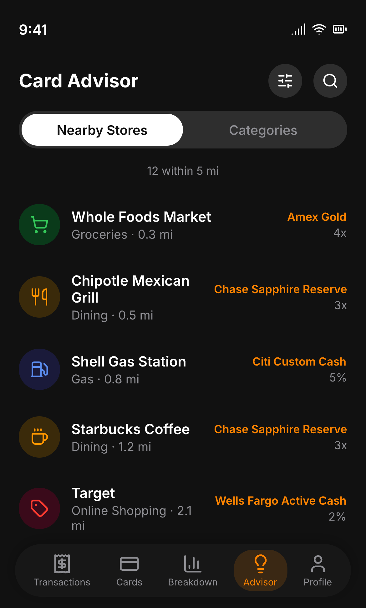
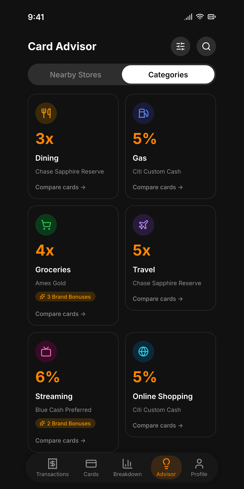
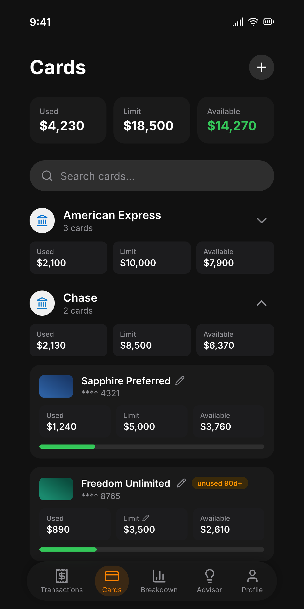

<div align="center">


# SwipeWise

### The right card, here, now.

**SwipeWise tells you which credit card to use at which store — to squeeze the most cashback and points out of every swipe.** Privacy-first, on your device, no account required.

<br>


</div>

---

Most rewards apps stop at the category: *"use this card for groceries."* SwipeWise goes one
level deeper — to the **store and the brand**. Walk into Whole Foods and it tells you to tap
your Prime Visa for **5%**, not just "a grocery card." That store-level, brand-aware moment
— *right card, right here, right now* — is what SwipeWise is built around, and it's the one
moment no other rewards app actually owns.

## ✨ What you get

- 🏪 **Best card at every store.** Store- and brand-level recommendations, not just generic
  categories. Whole Foods → Prime Visa (5%), Costco → the card that *isn't* excluded there.
- 📍 **Nudges when you arrive.** Geofenced notifications surface your best card as you walk
  into a store — no need to open the app or remember a thing.
- 🗂️ **Your wallet in seconds.** Pick your cards from a catalog of hundreds of US credit
  cards — no forms, no card numbers, no account.
- 📊 **Every category ranked.** An Advisor that ranks every card you own — by nearby store,
  spend category, or merchant brand, with one search across all three.

> **Pro (not yet available).** Bank linking via the FDX open-finance standard, real
> transaction history, monthly spending breakdown and recurring-charge routing are built and
> in this repo, but dormant: they need a server that holds the aggregator credentials, and
> that doesn't exist yet. See [the split plan](docs/setup.md#tiers--one-binary-runtime-entitlement).
- 🔒 **Private by design.** Everything lives on your phone. No SwipeWise server, no
  telemetry, no location history. (More below.)

## 📱 Screens

<div align="center">
<table>
  <tr>
    <td align="center"><br><sub><b>Best card at every store</b></sub></td>
    <td align="center"><br><sub><b>Ranked per category</b></sub></td>
    <td align="center"><br><sub><b>Your whole wallet</b></sub></td>
  </tr>
</table>
</div>

## 🔒 Privacy first — by architecture, not promise

This is a core value, not a marketing line:

- **No accounts, no user database.** The only SwipeWise-operated service is a stateless
  Cloudflare Worker that serves the card catalog and looks up nearby stores — it stores
  nothing you send it, so there's nowhere on our side for your data to accumulate.
- **On-device only.** Your wallet and its rewards live in a local SQLite database on your
  phone (and, on Pro, your transactions too — same database, same device).
- **No tracking, no ads.** Nothing records which cards you're shown, which notifications
  fire, or what you tap. Crash reports are the one exception, and carry no wallet, no
  location and no account.
- **Location stays yours.** Your precise GPS fix never leaves the device; only a location
  *rounded to ~110 m* is sent to Google Places to find nearby stores.
- **No account at all.** No sign-up, no email, no password — open the app and use it. Your
  identity is a random id generated on your device that is never sent anywhere.

Full details: [docs/PRIVACY.md](docs/PRIVACY.md).

## 🛠️ Built with

Flutter (Material 3) · Riverpod · sqflite · Google Places API · native Android geofencing ·
a Cloudflare Worker serving the rewards catalog. Android today; iOS later.

The Pro path adds Firebase Auth and Sophtron (FDX-standard bank data). That code is in this
repo and dormant — it needs a server holding the aggregator credentials, which doesn't exist
yet.

## 🤝 Open source & contributing

The **app is open source** — fork it, audit the privacy claims, build it yourself. The
*data* that powers the recommendations is where contributions land:

- [`assets/vocab/brands.json`](assets/vocab/brands.json) — the merchant → category + brand-id
  registry the recommender matches against, and **the file to contribute to**. Adding a store is a
  one-line JSON edit (see [docs/classifier-and-brands.md](docs/classifier-and-brands.md)). It's the
  single source of truth — bundled into the app, served via the catalog API, and
  read by the catalog engine.
- [`assets/catalog/free.json`](assets/catalog/free.json) — the reward
  **catalog** (card products, structured `reward_rules`, point valuations, `product_perks`). This is
  a **generated artifact** built from curated source by a separate engine; editing it directly is
  overwritten on the next publish, so card-data fixes go through the engine, not a PR here. Served to
  the app by the catalog API, refreshed without an app release (see
  [docs/reward-catalog.md](docs/reward-catalog.md)).

Good first contributions: add brands you shop at, or expand card coverage. Start with the
[architecture overview](docs/architecture.md) to see how the pieces fit.

## 🚀 Get started

Requires the Dart SDK ≥ 3.11.5 (built with Flutter 3.44, stable channel).

The app ships as **one binary for both tiers**. Pro is sold as an in-app subscription, so
its features unlock at runtime rather than at compile time — the Pro code is present and
dormant for everyone, and lights up when the entitlement says so. Which tier a *local* build
behaves as is decided by the keys file you pass:

`keys.free.json` is **committed** — it holds no credential, only two URLs:

```json
{
  "R2_BASE_URL": "https://swipewise-api.jacobceles.workers.dev",
  "PLACES_PROXY_URL": "https://swipewise-api.jacobceles.workers.dev/places/nearby"
}
```

Nearby search goes through the Worker, which holds the Google Places key server-side, so no
Places credential exists in the app to configure or to leak.

```bash
flutter run --dart-define-from-file=keys.free.json   # what ships
flutter run --dart-define-from-file=keys.pro.json    # + bank sync, for development
```

`keys.pro.json` adds `SOPHTRON_USER_ID`, `SOPHTRON_ACCESS_KEY`, `SOPHTRON_CUSTOMER_SALT` and
`"SWIPEWISE_PRO": "true"`, and stays untracked. The published release is built from
`keys.free.json`, so the aggregator credentials are simply not in it — a value that isn't in
the binary can't be extracted from it. `tool/verify_release_apk.py` fails the build if any
credential reaches the APK, and runs on every pull request.

Full build/release/keys details: [docs/setup.md](docs/setup.md).

## 📚 Documentation

| Doc | Covers |
|---|---|
| [Architecture](docs/architecture.md) | How the app, classifier, and catalog fit together |
| [Sophtron sync](docs/sophtron.md) | Bank linking, FDX reads, the sync engine |
| [Classifier & brands](docs/classifier-and-brands.md) | How a merchant becomes a recommendation |
| [Reward catalog & engine](docs/reward-catalog.md) | Catalog data → the pure reward engine/ranker |
| Catalog API *(separate private repo)* | The Cloudflare Worker that serves the catalog + the CLI that publishes it to R2. Server-side code lives outside this repo so user-data infrastructure never shares a deploy with the public catalog API — see [what a wallet backup stores](docs/BACKUP_SCHEMA.md) |
| [Nearby & geofences](docs/nearby.md) | Google Places search, tile cache, geofences, notifications |
| [Database](docs/database.md) | Full SQLite schema |
| [Setup](docs/setup.md) | Keys, build flags, git hooks, troubleshooting |
| [Privacy](docs/PRIVACY.md) | What's collected, where it goes, what's never stored |

## 📄 License

[MIT](LICENSE). Use it, fork it, ship it — attribution and the licence text are the only
conditions.

Worth knowing what you're getting: the app is the whole app, but the **recommendations are
only as good as the data behind them** — the brand registry and the rewards catalog. Those
are generated from a separate curation pipeline, and keeping ~223 cards accurate as issuers
reword their terms is the ongoing work. `assets/vocab/brands.json` is the file to send a PR
against; card data goes through the pipeline rather than a direct edit
(see [docs/reward-catalog.md](docs/reward-catalog.md)).
