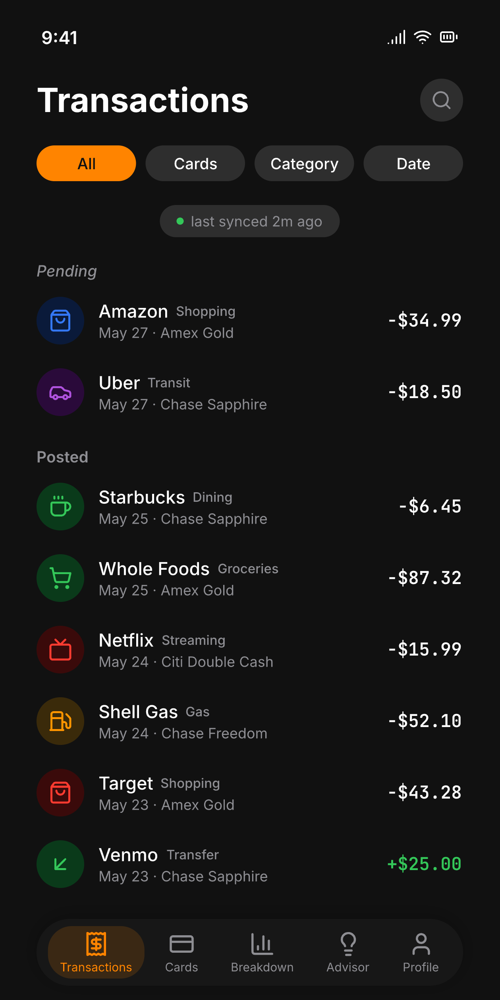
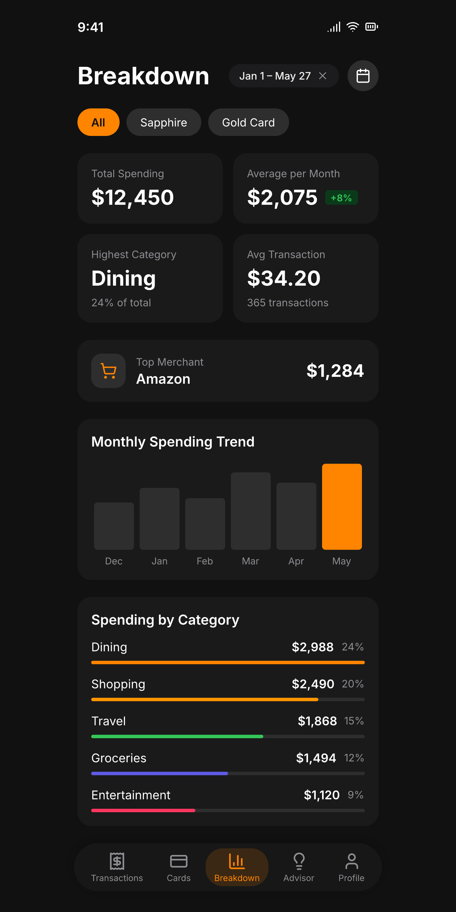
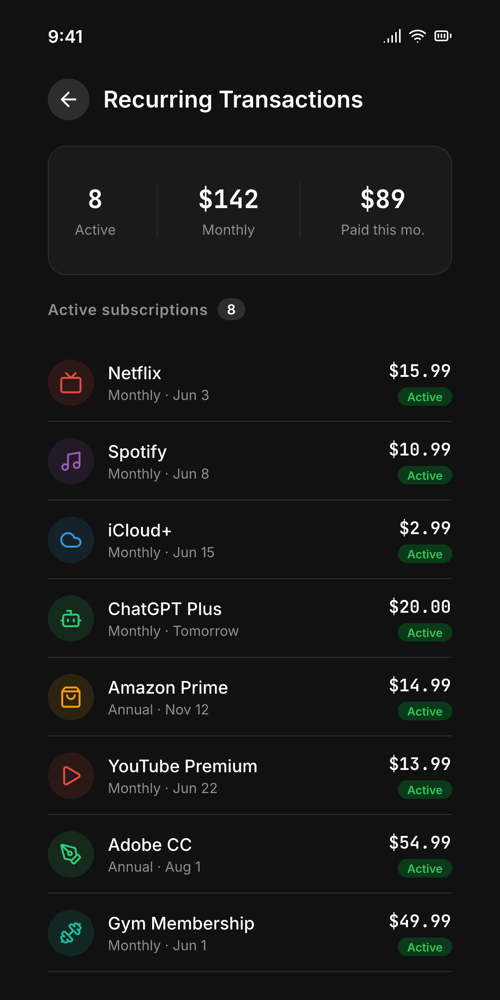

<div align="center">


# SwipeWise

### The right card, here, now.

**SwipeWise tells you which credit card to use at which store — to squeeze the most cashback and points out of every swipe.** Privacy-first, on your device, no account required.

<br>


</div>

---

Most rewards apps stop at the category: *"use this card for groceries."* SwipeWise goes one
level deeper — to the **store and the brand**. Walk into Whole Foods and it tells you to tap
your Prime Visa for **5%**, not just "a grocery card." That store-level, brand-aware moment
— *right card, right here, right now* — is what SwipeWise is built around, and it's the one
moment no other rewards app actually owns.

## ✨ What you get

- 🏪 **Best card at every store.** Store- and brand-level recommendations, not just generic
  categories. Whole Foods → Prime Visa (5%), Costco → the card that *isn't* excluded there.
- 📍 **Nudges when you arrive.** Geofenced notifications surface your best card as you walk
  into a store — no need to open the app or remember a thing.
- 🗂️ **Your wallet in seconds.** Pick your cards from a catalog of hundreds of US credit
  cards — no forms, no card numbers, no account.
- 📊 **Every category ranked.** An Advisor that ranks every card you own — by nearby store,
  spend category, or merchant brand, with one search across all three.

> **Pro (not yet available).** Bank linking via the FDX open-finance standard, real
> transaction history, monthly spending breakdown and recurring-charge routing are built and
> in this repo, but dormant: they need a server that holds the aggregator credentials, and
> that doesn't exist yet. See [the split plan](docs/setup.md#tiers--one-binary-runtime-entitlement).
- 🔒 **Private by design.** Everything lives on your phone. No SwipeWise server, no
  telemetry, no location history. (More below.)

## 📱 Screens

<div align="center">
<table>
  <tr>
    <td align="center"><br><sub><b>Best card at every store</b></sub></td>
    <td align="center"><br><sub><b>Your spending</b></sub></td>
    <td align="center"><br><sub><b>Where it goes</b></sub></td>
  </tr>
  <tr>
    <td align="center"><br><sub><b>Your whole wallet</b></sub></td>
    <td align="center"><br><sub><b>Subscriptions, routed</b></sub></td>
    <td align="center"><br><sub><b>Ranked per category</b></sub></td>
  </tr>
</table>
</div>

## 🔒 Privacy first — by architecture, not promise

This is a core value, not a marketing line:

- **No backend.** SwipeWise has no server. There's nowhere on our side for your data to go.
- **On-device only.** Cards, transactions, and rewards live in a local SQLite database on
  your phone.
- **No telemetry.** The app never phones home — not which cards you're shown, which
  notifications fire, nor what you tap.
- **Location stays yours.** Your precise GPS fix never leaves the device; only a location
  *rounded to ~110 m* is sent to Google Places to find nearby stores.
- **No account at all.** No sign-up, no email, no password — open the app and use it. Your
  identity is a random id generated on your device that is never sent anywhere.

Full details: [docs/PRIVACY.md](docs/PRIVACY.md).

## 🛠️ Built with

Flutter (Material 3) · Riverpod · sqflite · Firebase Auth · Sophtron (FDX-standard bank
data) · Google Places API + native Android geofencing. Android today; iOS later.

## 🤝 Open source & contributing

The **app is open source** — fork it, audit the privacy claims, build it yourself. The
*data* that powers the recommendations is where contributions land:

- [`assets/vocab/brands.json`](assets/vocab/brands.json) — the merchant → category + brand-id
  registry the recommender matches against, and **the file to contribute to**. Adding a store is a
  one-line JSON edit (see [docs/classifier-and-brands.md](docs/classifier-and-brands.md)). It's the
  single source of truth — bundled into the app, served via the [catalog API](swipewise-api), and
  read by the catalog engine.
- [`swipewise-api/catalog/catalog.json`](swipewise-api/catalog/catalog.json) — the reward
  **catalog** (card products, structured `reward_rules`, point valuations, `product_perks`). This is
  a **generated artifact** built from curated source by a separate engine; editing it directly is
  overwritten on the next publish, so card-data fixes go through the engine, not a PR here. Served to
  the app by the [catalog API](swipewise-api), refreshed without an app release (see
  [docs/reward-catalog.md](docs/reward-catalog.md)).

Good first contributions: add brands you shop at, expand card coverage, or pick up something
from the [roadmap](todo/roadmap.md). Start with the [architecture
overview](docs/architecture.md) to see how the pieces fit.

## 🚀 Get started

Requires the Dart SDK ≥ 3.11.5 (built with Flutter 3.44, stable channel).

The app ships as **one binary for both tiers**. Pro is sold as an in-app subscription, so
its features unlock at runtime rather than at compile time — the Pro code is present and
dormant for everyone, and lights up when the entitlement says so. Which tier a *local* build
behaves as is decided by the keys file you pass:

```json
// keys.free.json
{
  "GOOGLE_PLACES_KEY": "<google-places-api-key>",
  "GOOGLE_ANDROID_PACKAGE": "com.appsoflife.swipewise.dev",
  "R2_BASE_URL": "<swipewise-api worker url>"
}
```

```bash
flutter run --dart-define-from-file=keys.free.json   # what ships
flutter run --dart-define-from-file=keys.pro.json    # + bank sync, for development
```

`keys.pro.json` adds `SOPHTRON_USER_ID`, `SOPHTRON_ACCESS_KEY`, `SOPHTRON_CUSTOMER_SALT` and
`"SWIPEWISE_PRO": "true"`. The published release is built from `keys.free.json`, so the
aggregator credentials are simply not in it — a value that isn't in the binary can't be
extracted from it. `tool/verify_release_apk.py` fails the build if they ever are.

Full build/release/keys details: [docs/setup.md](docs/setup.md).

## 📚 Documentation

| Doc | Covers |
|---|---|
| [Architecture](docs/architecture.md) | How the app, classifier, and catalog fit together |
| [Sophtron sync](docs/sophtron.md) | Bank linking, FDX reads, the sync engine |
| [Classifier & brands](docs/classifier-and-brands.md) | How a merchant becomes a recommendation |
| [Reward catalog & engine](docs/reward-catalog.md) | Catalog data → the pure reward engine/ranker |
| [Catalog API](swipewise-api/README.md) | The Cloudflare Worker that serves the catalog + the CLI that publishes it to R2 |
| [Nearby & geofences](docs/nearby.md) | Google Places search, tile cache, geofences, notifications |
| [Database](docs/database.md) | Full SQLite schema |
| [Setup](docs/setup.md) | Keys, build flags, git hooks, troubleshooting |
| [Privacy](docs/PRIVACY.md) | What's collected, where it goes, what's never stored |

Where it's headed: the [catalog](todo/rewards_catalog.md) and [roadmap](todo/roadmap.md).

## 📄 License

[MIT](LICENSE) — do whatever you want with the code. Honestly, anyone can build a
card-recommender; the hard part (and the real value) is the **data** that makes the
recommendations good — the brand registry and the rewards catalog — which is where the
project's curation effort goes.
