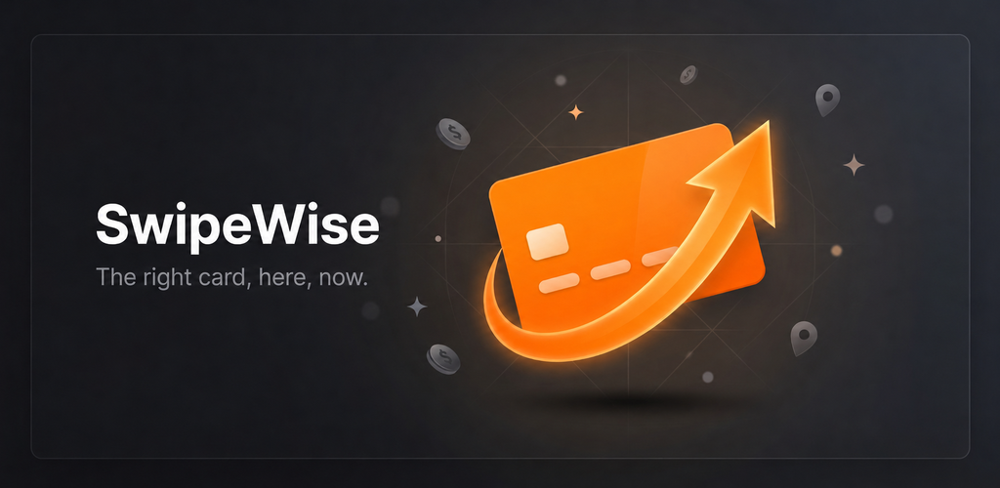
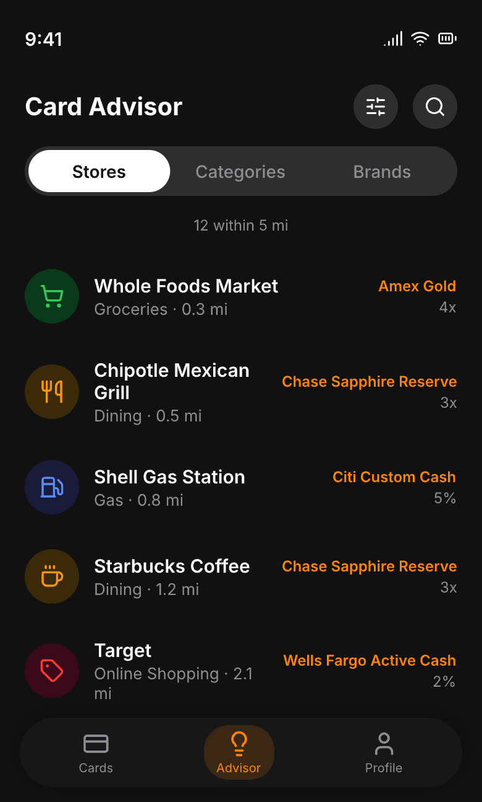
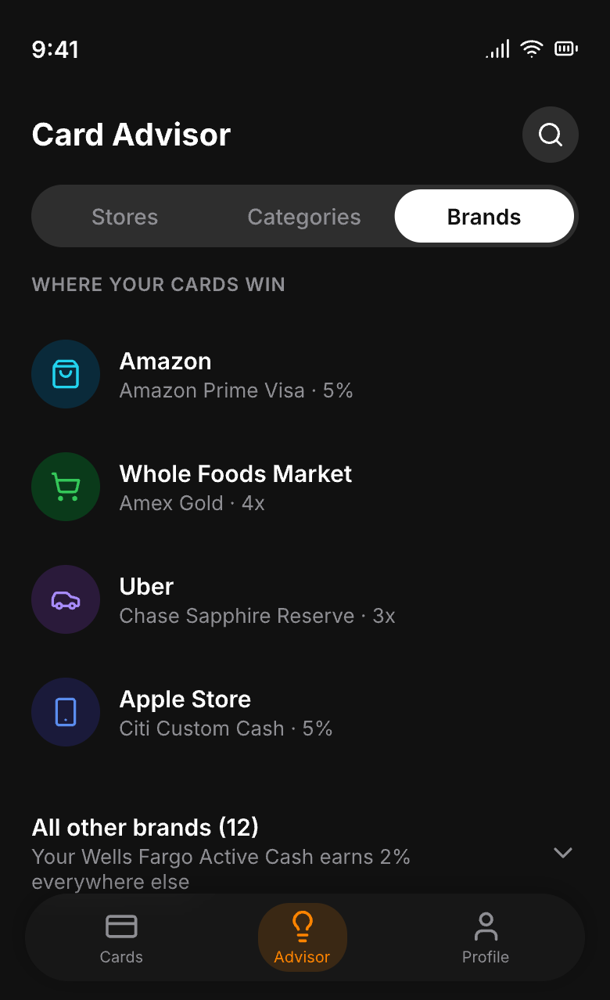
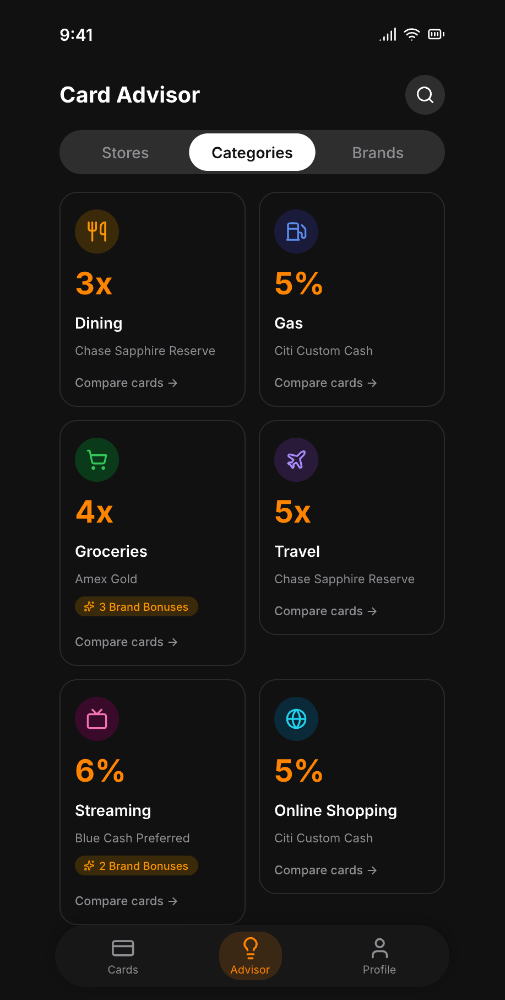
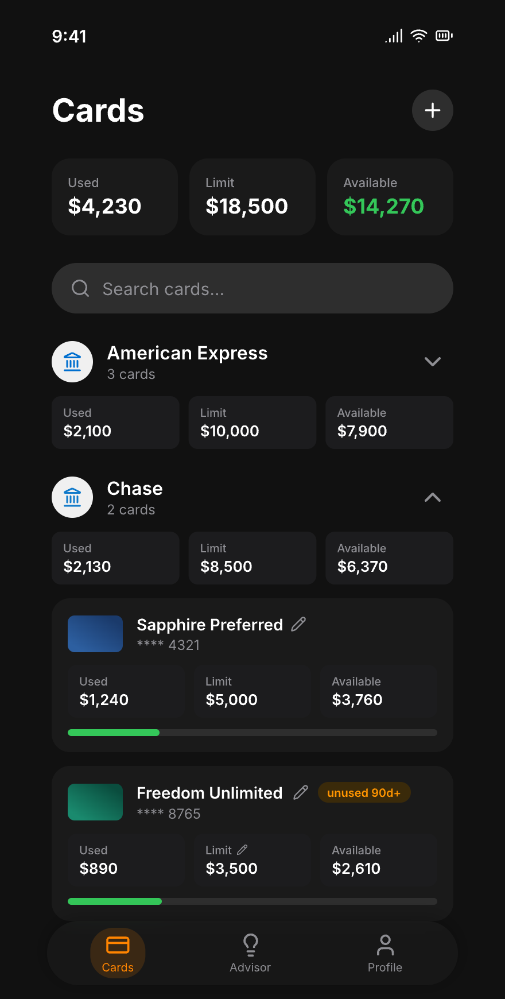
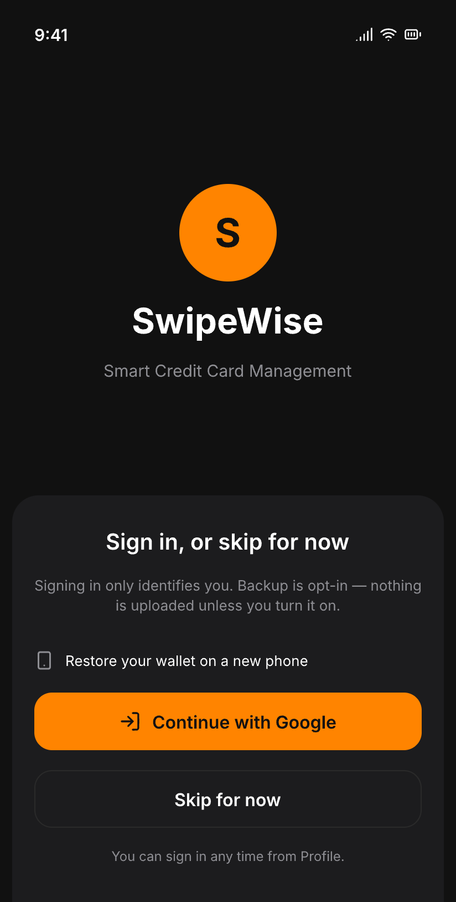

<div align="center">


# SwipeWise

### The right card, here, now.

**SwipeWise tells you which credit card to use at which store — to squeeze the most cashback and points out of every swipe.** Privacy-first, on your device, no account required.

<br>



</div>

---

Most rewards apps stop at the category: *"use this card for groceries."* SwipeWise goes one
level deeper — to the **store and the brand**. Walk into Whole Foods and it tells you to tap
your Prime Visa for **5%**, not just "a grocery card." That store-level, brand-aware moment
— *right card, right here, right now* — is what SwipeWise is built around, and it's the one
moment no other rewards app actually owns.

## 📲 Try it

SwipeWise is on Google Play in **closed testing** — there's no public store page yet, and
testers are added by hand. Want in?
[Open an issue](https://github.com/jacobceles/swipewise/issues/new) with the Google account
your phone signs into, and you'll get added to the test.

Prefer to build it yourself? [Get started](#-get-started).

## ✨ What you get

- 🏪 **Best card at every store.** Store- and brand-level recommendations, not just generic
  categories. Whole Foods → Prime Visa (5%), Costco → the card that *isn't* excluded there.
- 📍 **Nudges when you arrive.** Geofenced notifications surface your best card as you walk
  into a store — no need to open the app or remember a thing.
- 🗂️ **Your wallet in seconds.** Pick your cards from a catalog of hundreds of US credit
  cards — no forms, no card numbers, no account.
- 📊 **Every category ranked.** An Advisor that ranks every card you own — by nearby store,
  spend category, or merchant brand, with one search across all three.

- 🔒 **Private by design.** Your wallet lives on your phone; backup is opt-in and your
  transactions never leave the device. (More below.)

> **Pro (not yet on sale).** Bank linking via the FDX open-finance standard, real transaction
> history and recurring-charge routing are built, and the service
> that holds the aggregator credentials is live. What is missing is billing — entitlement is
> granted by hand today. See [the tier model](docs/setup.md#tiers--one-binary-runtime-entitlement).

## 📱 Screens

<div align="center">
<table>
  <tr>
    <td align="center"><br><sub><b>Best card at every store</b></sub></td>
    <td align="center"><br><sub><b>Where your cards win</b></sub></td>
    <td align="center"><br><sub><b>Every category ranked</b></sub></td>
    <td align="center"><br><sub><b>Your whole wallet</b></sub></td>
    <td align="center"><br><sub><b>No account needed</b></sub></td>
  </tr>
</table>
</div>

## 🔒 Privacy first — by architecture, not promise

This is a core value, not a marketing line:

- **Signing in is optional, and it is not the app.** Skip it and nothing changes — the app
  works exactly the same, keyed to an id minted on your phone that is never sent anywhere.
  Sign in and you get an account you can back up to; that is the whole difference.
- **Backup is opt-in and off by default.** Nothing is uploaded unless you switch it on. When
  you do, it carries your cards, your edits to them and your preferences —
  [documented exactly, field by field](docs/BACKUP_SCHEMA.md).
- **Your transactions never leave the device.** Not in a backup, not ever. Spend history lives
  in a local SQLite database on your phone and stays there. There is a test asserting a backup
  payload cannot contain one, because a promise nobody checks is just a sentence.
- **Bank credentials are not ours to hold.** Linking a bank goes through a service that signs
  the request; the app carries no aggregator credentials at all, and the service forwards
  without storing what comes back.
- **No tracking, no ads.** Nothing records which cards you're shown, which notifications
  fire, or what you tap. Crash reports are the one exception, and carry no wallet, no
  location and no account.
- **Location stays yours.** Your precise GPS fix never leaves the device; only a location
  *rounded to ~110 m* is sent to Google Places to find nearby stores.
Full details: [Privacy Policy](https://jacobcelestine.com/swipewise/privacy_policy.html).

## 🛠️ Built with

Flutter (Material 3) · Riverpod · sqflite · Google Places API · native Android geofencing ·
a Cloudflare Worker serving the rewards catalog. Android today; iOS later.

The Pro path adds Firebase Auth and FDX-standard bank data through an aggregator. The app
holds no aggregator credentials: a Cloudflare Worker over D1 checks who is asking, checks
they are entitled, and signs on their behalf.

## 🤝 Open source & contributing

The **app is open source** — fork it, audit the privacy claims, build it yourself. The
*data* that powers the recommendations is where contributions land:

- [`assets/vocab/brands.json`](assets/vocab/brands.json) — the merchant → category + brand-id
  registry the recommender matches against, and **the file to contribute to**. Adding a store is a
  one-line JSON edit (see [docs/classifier-and-brands.md](docs/classifier-and-brands.md)). It's the
  single source of truth — bundled into the app, served via the catalog API, and
  read by the catalog engine.
- [`assets/catalog/free.json`](assets/catalog/free.json) — the reward
  **catalog** (card products, structured `reward_rules`, point valuations, `product_perks`). This is
  a **generated artifact** built from curated source by a separate engine; editing it directly is
  overwritten on the next publish, so card-data fixes go through the engine, not a PR here. Served to
  the app by the catalog API, refreshed without an app release (see
  [docs/reward-catalog.md](docs/reward-catalog.md)).

Good first contributions: add brands you shop at, or expand card coverage. Start with the
[architecture overview](docs/architecture.md) to see how the pieces fit.

## 🚀 Get started

Requires the Dart SDK ≥ 3.12 (built with Flutter 3.47, stable channel).

The app ships as **one binary for both tiers**. Pro is sold as an in-app subscription, so
its features unlock at runtime rather than at compile time — the Pro code is present and
dormant for everyone, and lights up when the entitlement says so. Which tier a *local* build
behaves as is decided by the keys file you pass:

```bash
flutter run --dart-define-from-file=keys.free.json   # what ships
```

`keys.free.json` is **committed**: it holds three public URLs and no credential. There is
nothing secret left to put in a build — the Places key and the bank aggregator's credentials
both live in Cloudflare Workers, and the app talks to those rather than to the services
directly. `keys.pro.json` now differs only by `"SWIPEWISE_PRO": "true"`, which forces the Pro
*UI* on for local work; entitlement itself is decided server-side, so the flag grants nothing.

`tool/verify_release_apk.py` fails the build if a credential ever reaches the APK, and runs on
every pull request — a regression guard now rather than a live risk.

Full build/release/keys details: [docs/setup.md](docs/setup.md).

## 📚 Documentation

| Doc | Covers |
|---|---|
| [Architecture](docs/architecture.md) | How the app, classifier, and catalog fit together |
| [Bank sync](docs/sophtron.md) | Bank linking, FDX reads, the sync engine, and the signing proxy |
| [Classifier & brands](docs/classifier-and-brands.md) | How a merchant becomes a recommendation |
| [Reward catalog & engine](docs/reward-catalog.md) | Catalog data → the pure reward engine/ranker |
| Catalog API *(separate private repo)* | The Cloudflare Worker that serves the catalog + the CLI that publishes it to R2. Server-side code lives outside this repo so user-data infrastructure never shares a deploy with the public catalog API — see [what a wallet backup stores](docs/BACKUP_SCHEMA.md) |
| [Nearby & geofences](docs/nearby.md) | Google Places search, tile cache, geofences, notifications |
| [Database](docs/database.md) | Full SQLite schema |
| [Setup](docs/setup.md) | Keys, build flags, git hooks, troubleshooting |
| [Privacy](https://jacobcelestine.com/swipewise/privacy_policy.html) | What's collected, where it goes, what's never stored. Hosted, not bundled — one copy, so it cannot drift from what the app does |

## 📄 License

[MIT](LICENSE). Use it, fork it, ship it — attribution and the licence text are the only
conditions.

Worth knowing what you're getting: the app is the whole app, but the **recommendations are
only as good as the data behind them** — the brand registry and the rewards catalog. Those
are generated from a separate curation pipeline, and keeping ~414 cards accurate as issuers
reword their terms is the ongoing work. `assets/vocab/brands.json` is the file to send a PR
against; card data goes through the pipeline rather than a direct edit
(see [docs/reward-catalog.md](docs/reward-catalog.md)).
