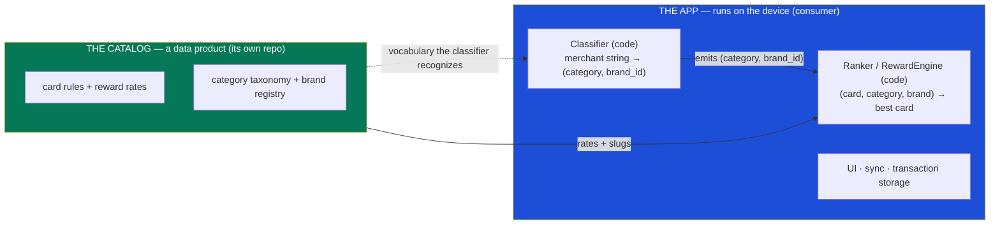
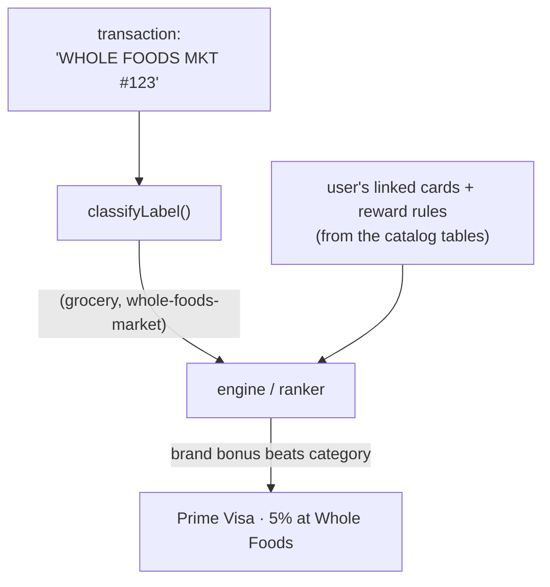
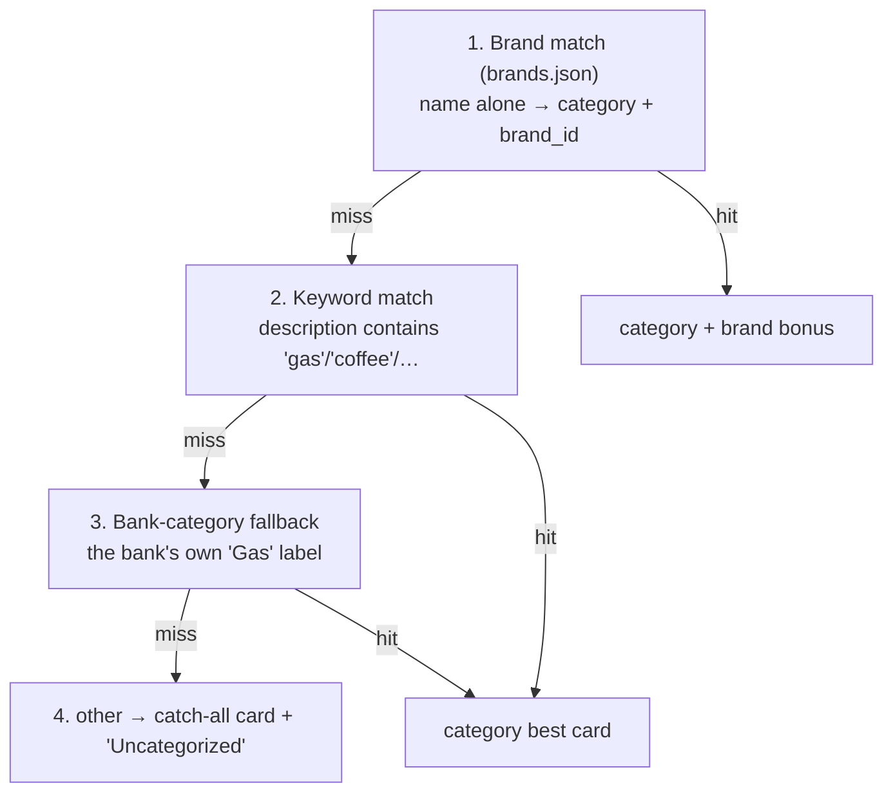

# Architecture

The big picture: how the app, the classifier, and the rewards data fit together, and why
the boundaries are drawn where they are.

## Two deployables + one shared vocabulary

There are really **two** things, not three. The "classifier" people reach for as a third
thing is a *module inside the app*, not a separate system.

- **The app** is the consumer. It runs two pieces of *logic* on the device: the
  **classifier** (recognition) and the **ranker/engine** (rate resolution). It owns the UI,
  sync, and local storage.
- **The catalog** is a *data product* — card reward rates + the vocabularies they're keyed
  on. It's built in [its own repo](reward-catalog.md) (the catalog
  pipeline, the backend engine), published to R2 by `swipewise-api`, and
  fetched at runtime from that service's Cloudflare Worker. One versioned JSON build, served
  ETag-gated; the app caches it locally and re-fetches only when it changes.
- The **classifier never moves to a backend.** It must process every synced transaction,
  offline, on the device. What *can* live elsewhere is the **data** it reads.

## The two data files

Everything reward-related is two files the app **fetches** from the catalog API
(`swipewise-api`) — not bundled assets. Neither is "owned" by the app —
the app *consumes* both. Each is produced by a **generator tool**; generating a file ≠
owning it.

| File | What it is | Generated by | Owned by (domain) | Consumed by |
|---|---|---|---|---|
| `catalog.json` | card products + reward rules + perks + art + point systems | the **catalog repo** (backend engine) | catalog / data product | `CatalogLoader` → catalog tables → the **engine/ranker** → Advisor + Cards page |
| `brands.json` | brand → category + match aliases | curated (Gemini today) | catalog / data product | the **classifier** → tags transactions |

Both are published to R2 and served by `swipewise-api`'s Cloudflare Worker; the app caches
each locally (ETag-gated) and re-fetches only on a content change.

> See [reward-catalog.md](reward-catalog.md) and [classifier-and-brands.md](classifier-and-brands.md)
> for the file shapes and load paths.

## The shared vocabulary

The classifier (producer) and the catalog (consumer) only meet on **two slug
vocabularies** — they don't share code:

- **`RewardCategory`** — the taxonomy of 30 earning categories. Canonical list lives in
  [reward_category.dart](../lib/models/reward_category.dart) (the app's enum *is* the typed,
  icon-decorated view of it). `reward_rules.category` references it.
- **`brand_id`** — slugs like `whole-foods-market`, `costco`. The registry is
  `brands.json`. `reward_rules.brand` references it.

A rule that references a slug the classifier can't produce is **dead** — no transaction
will ever carry it. That's why brand/category coverage is a contract, validated at build
time (see [the slug contract](classifier-and-brands.md)).

## How a swipe becomes a recommendation

1. **Classify** — `classifyLabel("WHOLE FOODS MKT #123")` → `(category: grocery, brand_id:
   whole-foods-market)`. The category does the 30-category job; the `brand_id` is the handle
   for merchant-specific rules.
2. **Rank** — the ranker looks up the best card by `brand_id` (brand bonus) and by
   `category` (best grocery card), and **brand wins** when present. Without the `brand_id`
   you'd only ever get the best *grocery* card; with it you get Prime Visa's Whole-Foods 5%.

The same path runs from two entry points (see [nearby.md](nearby.md) for the nearby flow):

- **Sync** feeds one string (the bank description) through `classifyLabel`.
- **Nearby** has two inputs — the Google Places *merchant name* → `brand_id`, and the
  Places *primaryType* → `category` — resolved against the same `brands.json`.

## The unknown-brand failure ladder

The recommender degrades gracefully — it's never *wrong*, just progressively less specific:

Worst case is a defensible catch-all recommendation and an "Uncategorized" breakdown row —
never a crash. Adding the brand to `brands.json` collapses the ladder back to step 1.

## Two columns, two vocabularies (a consequence)

Because the catalog and classifier speak `RewardCategory.name`, transactions carry **two**
category columns ([database.md](database.md)):

- `category` — display only (the bank's free-text label, e.g. "Food & Drink").
- `reward_category` — canonical `RewardCategory.name` (e.g. `onlineGrocery`), written by
  the classifier for every debit. The engine/ranker and insights key on this; it matches
  `reward_rules.category` in the catalog.

## How the rewards data is modeled

The rewards data is a properly-modeled **catalog**: the `catalog.json` build, fetched from
the catalog API → `CatalogLoader`
hydrates the global catalog tables (`card_products`/`reward_rules`/… ) →
`CatalogRepository.loadSnapshot()` builds an immutable `CatalogSnapshot` → a pure
`RewardEngine.resolve()` resolves rates, wrapped by `engine_ranker`. The catalog lives in
its own data-product repo; the app is the consumer. The classifier stays app-side; the
brand/category vocabularies stay the contract. See [reward-catalog.md](reward-catalog.md).

## The tab shell keeps off-screen tabs alive

`HomeScreen` renders every tab into an `IndexedStack`
([`home_screen.dart`](../lib/screens/home_screen.dart)), so a tab that is not on screen is still
mounted — it just never rebuilds.

⚠️ **A data tab therefore goes stale after a sync or an add-bank unless it watches a
sync-coupled trigger.** Invalidating the provider is not enough on its own: nothing rebuilds an
off-screen child, so the tab shows pre-sync data until the user happens to visit it and something
else forces a rebuild. Watch a sync-coupled provider in any tab whose contents a background
operation can change.
