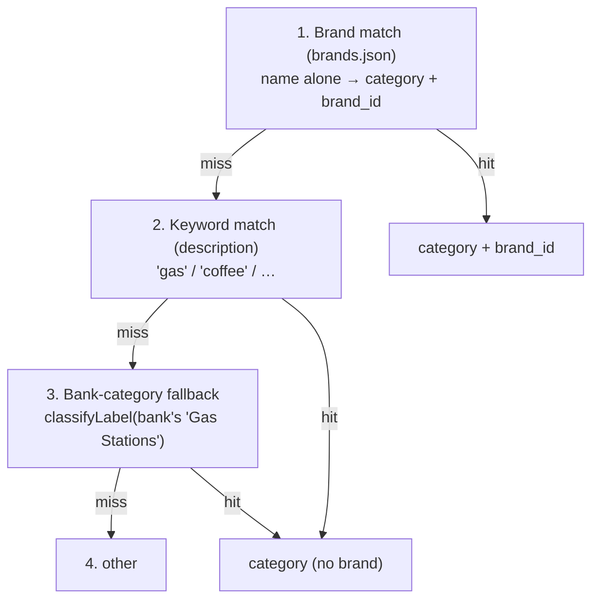

# Classifier & brands

The classifier turns a messy merchant string into a `(RewardCategory, brand_id)` pair. It's
pure app-side code, runs on-device and offline, and produces the category/brand vocabulary
the engine/ranker and the catalog's rules are keyed on. See
[architecture.md](architecture.md) for where it sits.

## `classifyLabel`

[`reward_category_mapper.dart`](../lib/api/reward_category_mapper.dart):

```dart
({RewardCategory category, String? brandId}) classifyLabel(String label)
```

Two passes over the input string:

1. **Brand pass** — match against the brand registry (`brands.json`). Returns the brand's
   `(category, brand_id)`. Longest contiguous alias wins.
2. **Keyword pass** — match against the in-code category table (`gas`, `coffee`, `dining`…).
   Returns `(category, null)`.
3. Falls through to `(other, null)`.

Matching is **token-level and contiguous**, with diacritic normalization — so "uber" never
matches inside "hubert", and "walmart" never matches "Mart Coffee". The longest alias wins
regardless of declaration order ("uber eats" beats "uber").

`classifyLooseLabel(label)` is a thin wrapper returning just the category (used by the
nearby path on Google Places `primaryType` labels).

## The classifier does NOT classify reward rows

The classifier runs on **merchant strings** — bank-transaction descriptions and Google Places
display names — and nothing else. It does **not** classify the catalog's reward rows. The catalog
ships its `reward_rules` already **pre-structured by the producer** (the catalog repo): each
rule already carries its `category` (a `RewardCategory` slug) and/or `brand` (a `brand_id`
slug) and a typed `kind`. The app does no app-side re-classification of rewards — it loads
the rules as-is (see [reward-catalog.md](reward-catalog.md)).

This is the contract that keeps the two halves agreeing: because a `reward_rules.brand` is a
real `brand_id` slug, a card's Whole-Foods brand bonus and a transaction tagged
`whole-foods-market` line up only when the classifier can *produce* that slug from the
merchant string. The producer references the same `brands.json` / `RewardCategory`
vocabulary the classifier emits — neither side re-derives it.

> A free-text reward classifier (`classifyReward` / `RewardEmission`) still exists in
> `reward_category_mapper.dart` but is **dead code** in the catalog era (only a test calls
> it) — it's not part of the live flow.

## Two outputs, two jobs

The `category` and the `brand_id` do different work — and the `brand_id` is the one that
earns the file's existence:

- **`category`** → which of the 30 earning `RewardCategory` categories. Somewhat *redundant* — keywords
  or the bank's own category can often supply it.
- **`brand_id`** → the handle for **merchant-specific** rewards that category can't express:
  brand bonuses (Prime Visa's 5% *at Whole Foods*, keyed on `whole-foods-market`) and
  exclusions ("wholesale 2% *except Costco*", keyed on `costco`). Only brand recognition
  produces this.

Without `brand_id`, "best card at Whole Foods" returns your best *grocery* card; with it, it
returns Prime Visa's 5%.

## The recognition cascade

At sync time, the classifier runs on the bank `description`. When it misses, a fallback rung
tries the bank's own free-text `category` ([bank_write_repository.dart](../lib/api/bank_write_repository.dart)):



It degrades gracefully — never *wrong*, just less specific. A `null` brand just means "no
brand bonus matched"; the engine falls back to the category rate, then baseline. (The
nearby path runs the same registry but splits the inputs — see
[nearby.md](nearby.md).)

## `brands.json` — brand knowledge as data ("Channel B")

`brands.json` (served by the [catalog API](../swipewise-api)) is an array of:

```json
{ "brandId": "whole-foods-market", "displayName": "Whole Foods Market",
  "category": "grocery", "aliases": ["whole foods"] }
```

- `category` must be a real `RewardCategory.name`.
- `aliases` are lowercase match phrases. Because normalization splits on non-alphanumerics,
  POS strings that drop apostrophes need both forms (`"mcdonalds"` **and** `"mcdonald s"`).

It's loaded once at boot by **`initBrandRegistry()`** (called from
[main.dart](../lib/main.dart) before the first sync): it reads the local R2 cache from the
previous launch into the in-memory registry and kicks off a background refresh, falling back
to the compiled-in `_defaultBrandTable` until R2 delivers a fresh copy. The classifier stays
synchronous — the registry is populated before any classify call.

Making brands **data, not code** means a new store can be taught by editing JSON, no
app-logic change — the same JSON the catalog API serves. The
[`BrandResolver`](../lib/api/brand_resolver.dart) (used by the nearby path) rebuilds from
`registeredBrands()` each sync, so it picks up the loaded registry automatically. There is
**no `brands` SQLite table** — the registry is the single source of truth.

## Who owns it

`brands.json` is **catalog-domain data** (the merchant-recognition vocabulary), currently
*generated* by Gemini and *served* by the [catalog API](../swipewise-api) — parallel to the
catalog build being produced in its own repo and served the same way. The app *consumes* it;
it doesn't own it. The classifier *emits* `brand_id`s the
catalog's `reward_rules` *reference*. See
[the slug contract](../todo/rewards_catalog.md#the-slug-contract-brands--categories).

## Curation & validation

There's no telemetry feedback loop (the app doesn't collect user transactions). Brand
coverage is **curation-driven**: ask Gemini for more brands (see
[`todo/reference_brands_prompt.md`](../todo/reference_brands_prompt.md)) or add a store you
hit yourself.

`brands.json` is now produced upstream and served via the [catalog API](../swipewise-api),
so the **slug contract** is enforced where the data is built (the producer pipeline), not by
a local app hook: every `category` must be a real `RewardCategory.name`, `brandId`s must be
unique, and `aliases` non-empty. A rule that references a slug the classifier can't produce is
dead — see [the slug contract](../todo/rewards_catalog.md#the-slug-contract-brands--categories).

## Why two category columns on transactions

The classifier writes the canonical bucket to `transactions.reward_category`
(`RewardCategory.name`), separate from the display `category` (the bank's free text). The
engine/ranker and insights key on `reward_category`; it matches the catalog's
`reward_rules.category`. See [database.md](database.md).
