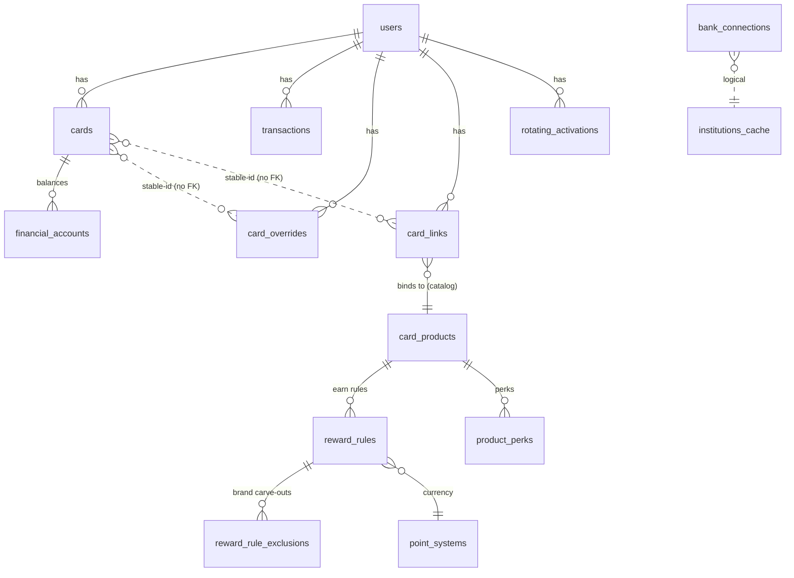

# Database

Local SQLite (`swipewise.db`), defined in
[`database_helper.dart`](../lib/api/database_helper.dart) — `_onCreate` builds the full
schema for fresh installs, `_onUpgrade` migrates existing installs version-to-version, with
`PRAGMA foreign_keys = ON`. All user-scoped tables cascade-delete from `users`.

## Core relationships

The **catalog** tables (`point_systems`, `card_products`, `reward_rules`,
`reward_rule_exclusions`, `product_perks`) are **global** — no user FK; hydrated from the
catalog build fetched from the catalog API. A user's synced `cards` reach them through one
`card_links` binding.

## Domains

### Identity & sync
| Table | Purpose | Key columns |
|---|---|---|
| `users` | account root; email is recovery key | `id` PK, `identifier`, `email`, `bank_customer_id`, `first_sync_completed_at` |
| `bank_connections` | one row per linked bank (Sophtron Member) | PK `(user_institution_id, user_id)`, `member_id`, `institution_id`, `last_sync_status` |
| `institutions_cache` | bank name/logo, **never wiped** (orphan tx keep their label) | `institution_id` PK, `name`, `logo` |
| `sync_state` | cross-isolate sync mutex (heartbeat-based liveness) | `user_id` PK, `acquired_at`, `heartbeat_at`, `holder` |
| `sync_runs` | per-run diagnostics (pruned to last 100) | `run_id` PK, `trigger`, counts, `outcome` |
| `api_circuit_breakers` | breaker state for external APIs | `service` PK, `failure_count`, `opened_until` |

### Cards & spend
| Table | Purpose | Key columns |
|---|---|---|
| `cards` | per-card metadata; id = `bank:<inst>:<last4>:<slug>` (or manual) | `id` PK, `source`, `provider`, `name`, `last_four`, `institution_id`, `image_url` |
| `card_overrides` | user edits that **survive sync wipes** (no FK to cards) | PK `(card_id, user_id)`, `manual_credit_limit`, `custom_name`, `product_identification` |
| `financial_accounts` | balance snapshot; full FDX payload in `raw_json` | `id` PK, `linked_card_id`, `balance_current/available/limit` |
| `transactions` | spend history, deduped by stable id | PK `(id, user_id)`, see below |

**`transactions` — the two category columns** (this is the important one):

| Column | Role |
|---|---|
| `category` | **display only** — the bank's free-text label ("Food & Drink"), or the classifier's human label as fallback. Never parsed back to an enum. |
| `reward_category` | **canonical** `RewardCategory.name` ("onlineGrocery"), written by the classifier for every debit. The engine/ranker + insights key on this; matches `reward_rules.category` in the catalog. |
| `brand_id` | free-form slug from `brands.json` — **no FK** (the registry is the source of truth; FKs only caught ordering bugs). |
| `type` | `DEBIT` (spend) / `CREDIT` (payment/refund). Amounts stored as ABS magnitude; direction is here. |

`transactions.id` = hash of `(card_id, date, cents, normalized-description)` so re-syncs
collapse duplicates. See [sophtron.md](sophtron.md#stable-ids).

### Rewards — the catalog (global, no user FK)

Hydrated from the `catalog.json` build (fetched from the catalog API) by `CatalogLoader`. Same
for every user; survives user-scoped wipes. See [reward-catalog.md](reward-catalog.md).

| Table | Purpose | Key columns |
|---|---|---|
| `point_systems` | a points/miles currency + its cents-per-point valuation | `point_system_id` PK, `display_name`, `baseline_cent_value`, `valuation_source`, `valuation_updated_at` |
| `card_products` | the issuer's marketed card | `card_product_id` PK, `issuer`, `display_name`, `network`, `annual_fee_usd`, `foreign_tx_fee_pct`, `image_url`, `catalog_version`, `retired_at` |
| `reward_rules` | one polymorphic earn rule per row | `rule_id` PK, `card_product_id`→products, `kind`, `category`, `brand`, `rate`, `point_system_id`→point_systems, `valid_from/to`, `rotation_year/quarter`, `requires_activation`, `cap_spend_amount_usd`, `cap_period`, `cap_group`, `notes`, `excluded_categories` (JSON array of RewardCategory names the rule does *not* extend to via the travel- or gas-superset match — e.g. Costco's `travel` excludes `transit`, or a `gas` rule excludes `evCharging`; added in schema v5) |
| `reward_rule_exclusions` | brand carve-outs for a rule | PK `(rule_id→reward_rules, brand)` |
| `product_perks` | card benefits/credits (replaces `card_perks`) | PK `(card_product_id→products, perk_id)`, `kind`, `title`, `description`, `frequency`, `value_estimate`, `calendar_max_year_amount`, `how_to_earn`, `image_uri`, `redemption_url` |

`reward_rules.kind` is the discriminator (`baseline`/`category`/`brand`/`rotating`/`promo`/
`partner_portal`). The `baseline` rule is the explicit "all other purchases" floor the
ranker keys off; `category`/`brand`/`exclusions` reference the slug vocabularies (see below).

### Rewards — user-side bindings

| Table | Purpose | Key columns |
|---|---|---|
| `card_links` | binds a synced `cards.id` → a catalog `card_product_id` | PK `(user_id, card_id)`, `card_product_id`, `source` (`user_confirmed`/`heuristic`/`preconfirmed`), `confidence`, `linked_at` |
| `rotating_activations` | per-user, per-quarter rotating-bonus enrollment (persisted, but **currently dormant** — there's no activation toggle, so the ranker assumes activated and doesn't consult this; see reward-catalog.md) | PK `(user_id, card_id, rotation_year, rotation_quarter)`, `activated_at` |
| `categories` | display metadata (icon per category) | `id` PK, `name`, `icon_id` |

`card_links`/`rotating_activations` carry **no FK on `card_id`** (only on `user_id`), so —
like `card_overrides` — they survive the per-institution wipe and re-attach when a card with
the same stable id reappears. A user's card reaches its rewards/perks through its one
`card_links` row.

### Nearby / geofence
| Table | Purpose |
|---|---|
| `merchant_tile_cache` | Google Places merchants per ~1km grid cell; LRU-evicted (200 cells, 7-day TTL) |
| `active_geofences` | currently-registered merchant geofences (dwell detection) |
| `boundary_geofence` | single-row app boundary tripwire (`CHECK id = 1`) |
| `merchant_notification_cooldown` | per-merchant notify throttle (6h) |
| `category_notification_cooldown` | per-category notify throttle (30 min) |

See [nearby.md](nearby.md).

## Two deliberate "no FK" choices

1. **`card_overrides` → `cards`** has no FK. Overrides (credit limit, rename, product id)
   must survive the per-institution wipe-and-reinsert, and re-attach when the card's stable
   id reappears. A FK would delete them on every sync.
2. **`*.brand_id`** is free-form text. The brand registry (`brands.json`) is the single
   source of truth and only ever produces slugs it defines, so a FK would only catch our own
   seeding-order bugs.

## Migrations

The app is past internal-testing first-install, so schema changes must be **migrated**, not
just folded into `_onCreate`: bump the `version` in `_initDatabase` and add an
`if (oldVersion < N)` block to `_onUpgrade` (running in order, so a tester N versions behind
replays each block), **and** mirror the same change into `_onCreate` so fresh installs reach
the same end state. The catalog cutover shipped as the `v2` block — it created the catalog
tables (`_createCatalogTables`) and dropped the dead seed tables (`wallet_rewards`,
`card_perks`). A purely local dev DB can still be reset by reinstalling (see
[setup.md](setup.md#local-data)).
