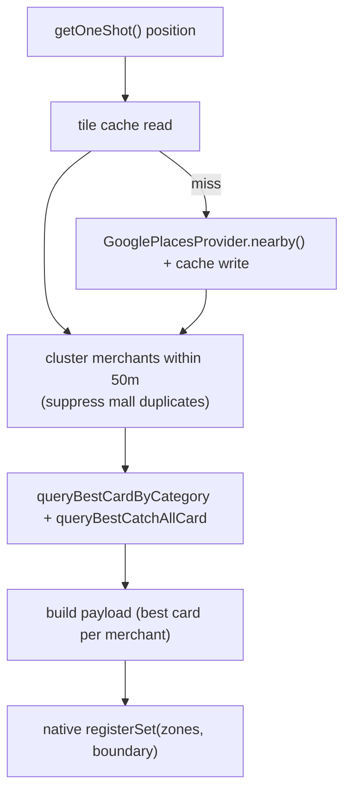

# Nearby stores

How "you're near a store, here's your best card" works — Google Places for place discovery, a
native `GeofencingClient` for dwell detection, and the same classifier/ranker as everywhere else.

## Fetch + tile cache

[`google_places_provider.dart`](../lib/nearby/google_places_provider.dart) — `nearby()` posts
to the Google Places API (New) `places:searchNearby` endpoint with a field mask covering only
Basic-tier fields (`places.id`, `places.displayName`, `places.location`, `places.primaryType`,
`places.businessStatus`). A `NearbyMerchant` keeps only `id`, `name`, `placeType`, `lat/lng`,
`distanceMi` — everything else is dropped. Results are sorted nearest-first (Haversine
client-side; the API doesn't return distance).

Privacy coarsening: lat/lng is rounded to 3 decimal places (~110 m) before sending.

[`tile_cache.dart`](../lib/nearby/tile_cache.dart) caches results per **~1km grid cell**
(`cell_id = "{round(lat*100)}:{round(lng*100)}"`) in `merchant_tile_cache`:
- **7-day TTL**, **200-cell LRU** (evicted on write by `last_accessed_at`).
- Reads scan the **3×3 neighborhood** around the user to avoid a "cache cliff" at cell
  boundaries, dedup by `merchant_id`, sort by distance.
- A cross-isolate circuit breaker (3 failures → 5-min cooldown) in `api_circuit_breakers`
  protects the API.

## Place roots

[`place_roots.dart`](../lib/nearby/place_roots.dart) defines 10 `PlaceRoot` groups (dining,
retail, travel, arts, sports, business, event, health, outdoors, community). Each group carries
a list of Google `includedTypes`; all enabled groups' types are merged into one API call. The
user toggles groups on/off in the nearby-categories screen; preference is stored under
`nearby_place_type_ids` in the `settings` table.

## Category labels

[`google_place_type_map.dart`](../lib/nearby/google_place_type_map.dart) maps Google
`primaryType` strings → display labels (`'restaurant'` → `'Dining'`, `'gas_station'` →
`'Gas'`, etc.). [`category_label_resolver.dart`](../lib/nearby/category_label_resolver.dart)
tries this map first, then falls back to name-substring heuristics.

EV charging stations (`electric_vehicle_charging_station`) now map to their own
`'EV Charging'` label — split out of `'Gas'` (a gas subcategory, mirroring transit under
travel). Five newer reward categories (apparel, electronics, sportingGoods, pets, medical)
are **reward-only for now**: their Google place types aren't yet wired into this map or the
place-roots search, so nearby detection doesn't route to them (a known follow-up).

## Location & permissions

[`location_service.dart`](../lib/nearby/location_service.dart) `getOneShot()` returns
`(lat, lng)` via Geolocator (medium accuracy, 10s timeout).

[`nearby_permission_gate.dart`](../lib/nearby/nearby_permission_gate.dart) runs an up-front
gate once per install, in a deliberate order (avoids a dialog race): notifications →
activity recognition → foreground location → explainer → background location (deep-links to
Settings on Android 11+). The OS won't grant background without foreground first.
`permissionGateCompleteProvider` blocks the Stores tab until the gate finishes.

Two background-reliability grants — **exact alarms** (SCHEDULE_EXACT_ALARM, denied by
default on Android 14+; powers the app-side dwell timers) and **ignore battery
optimizations** (OEM battery managers killing receivers is the top real-world cause of
silently missed alerts) — are detect-and-nudged, not one-shot asked: the Stores view
(also embedded in the Advisor tab) watches `reliabilityGrantsProvider` and shows a
banner while either grant is missing, exactly like the background-location banner.
Both degrade gracefully when declined; each `registerSet` logs their status to the
debug trail.

## Geofence registration

[`geofence_manager.dart`](../lib/nearby/geofence_manager.dart) `ensureRegistered()` is
idempotent (runs on app open):

Each merchant gets a **100m ENTER/EXIT geofence**; a single **boundary geofence** (median
registered-cluster distance, clamped 1–10km) acts as a re-registration tripwire. The
boundary must sit *inside* dense coverage — with the old "furthest merchant + 500m"
formula you could park beyond the covered merchants yet inside the boundary: no EXIT,
no re-registration, no notification. The native side
([`GeofencePlugin.kt`](../android/app/src/main/kotlin), channel `com.appsoflife/geofence`)
uses Google Play Services `GeofencingClient` with `INITIAL_TRIGGER_ENTER` (so a fence
registered around a store the user is already standing in still fires) — the OS monitors
geofences even when the app isn't running.

**Re-registration triggers** (how fences follow the user):

- App open / settings change / sync completion (Dart side, debounced).
- Boundary EXIT while **not** driving → expedited `ReregisterWorker` immediately.
- Boundary EXIT while **driving** → `PendingReregister` flag + a 5-min fallback alarm;
  the flag is consumed (worker runs) on the next activity-recognition STILL/WALKING
  transition, or by the fallback alarm if AR never delivers one (it re-arms itself while
  still driving). No churn mid-drive; fences land at the destination on arrival.
- Boot (Android wipes geofences on reboot).

The worker is **expedited** (`RUN_AS_NON_EXPEDITED_WORK_REQUEST` fallback) — a plain
request can be deferred minutes under Doze, which defeats fencing the destination before
the user walks into a store.

## Dwell detection

Dwell is decided **app-side**, not by the OS: `GEOFENCE_TRANSITION_DWELL` evaluates
loitering lazily on the OS's own location cadence and can fire minutes late. Instead:

1. Fence **ENTER** → `MerchantGeofenceReceiver` arms a one-shot [`DwellAlarms`] timer for
   that fence's per-category dwell seconds (exact alarm when granted, inexact otherwise).
2. Fence **EXIT** before it fires → timer cancelled (drove past / red light).
3. Timer fires → `DwellCheckReceiver` takes **one fresh balanced-power fix** (8s budget)
   and verifies: fix inside the fence (+accuracy +50m slack) → post; fix outside →
   rejected; no fix obtainable → post unless activity recognition says IN_VEHICLE
   (fail-open — a missed verification must not eat a legit notification).

Fence geometry + dwell seconds ride along in `GeofenceMetadataStore` so the receivers
need no Dart round-trip.

## Recommendation

For each nearby merchant the payload is built with the **same** classifier + ranker as the
sync path, just with two inputs instead of one ([architecture.md](architecture.md)):

- **category** ← `classifyLooseLabel(CategoryLabelResolver.labelFor(placeType, name))`
- **brand_id** ← `BrandResolver.resolve(merchant.name)` (built from `brands.json`)
- **best card** ← `byBrand[brand_id]` if matched, else `byCategory[category]`, else catch-all

## Notifications

Before posting, `DwellCheckReceiver` checks two cooldowns (both backed by SQLite tables
shared with the app):

- **per-merchant** — 6h (don't re-nudge the same store), with a smart re-arm: a
  **boundary EXIT clears all merchant cooldowns** — leaving the mapped area makes the
  next visit a new trip, so returning re-notifies. Walking to the car and back never
  crosses the boundary, so same-visit repeats stay suppressed by the 6h window.
- **per-category** — 30 min (suppress strip-mall spam; not cleared on boundary EXIT —
  it's the burst guard wherever the user lands next)

The notification names the brand-specific card when matched ("Use Prime Visa at Whole Foods
· 5%"), else the category's best card. Tapping carries the options JSON into the app, which
the Dart side consumes via `consumePendingMerchant()`.

## Muted stores

Any store in the Nearby list can be muted from its row (the bell toggle), which stops its
dwell notifications without hiding it from the list. Muted place ids live in the
device-level `muted_merchants` table (DB v7, `merchant_id` = Google place id) — not
user-scoped, matching the cooldown tables, since the native receivers read it without a user
context. Mute/unmute writes happen only in Dart (`DataRepository.muteMerchant` /
`unmuteMerchant`); native only reads. Manage the full list under **Profile → Muted Stores**.

Suppression happens at two layers:

- **Registration (Dart).** `GeofenceManager.ensureRegistered` drops muted merchants before
  building the fence set, so no fence is registered for them at all (this also frees a slot
  under the 50-fence cap). A mute/unmute triggers an immediate re-register (`trigger:
  'mute'`) so the change lands without waiting for the next boundary EXIT.
- **Post (native, belt-and-braces).** A fence registered *before* the mute is still in
  flight, so `DwellCheckReceiver.maybePost` re-checks `muted_merchants` (via the read-only
  `MutedStore`) *before* the cooldown checks. A single-merchant fence is suppressed when its
  merchant is muted; a **cluster** ("you may be at one of these") is suppressed only when
  *every* option is muted — one live option still earns a post. Fail-safe: any DB open/read
  failure reads as "not muted", so a transient miss never eats a legit notification.

This exists because a store whose 100m fence overlaps home re-notified on every return trip
(the boundary-EXIT cooldown re-arm defeats the 6h per-merchant window for an at-home fence).

## Notes

- `ACTIVITY_RECOGNITION` lets the OS distinguish a real dwell from a traffic stop.
- **No Places key is baked into the app.** Nearby search posts to `PLACES_PROXY_URL` — the
  Worker's `/places/nearby` — which holds the Google Places key as a server-side secret and
  forwards the request. The app attaches a Firebase App Check token (`X-Firebase-AppCheck`);
  the Worker verifies it against Google's JWKS with the audience pinned to the project, and
  **rejects unattested callers with 401**.
- App Check is activated in *both* isolates. Geofence re-registration runs headless and calls
  Places itself, and App Check state is per-isolate — activating only in `main()` leaves that
  path tokenless, so geofences silently stop re-registering.
- The **catalog** fetch (`remote_asset_service.dart`) also sends the token now, but the Worker's
  catalog routes do **not** reject on it yet. That order is deliberate and must not be inverted:
  a catalog 401 is invisible to the user because `catalog_loader.dart` falls back to the bundled
  offline copy, so enforcing before this build is released would strand un-updated installs on a
  stale catalog with nothing to show for it. The backend repo's README owns the rollout steps.
- ⚠️ **Attestation is not free — but do NOT add a token cache.** A Play Integrity round trip
  measured **~2.2 s**. `getToken()` already "will use a cached token if found in storage" and
  "attaches to the most recent in-flight request if one is present" — *storage*, so the cache
  outlives an isolate, and in-flight attaching, so concurrent callers share one round trip. A
  second cache in app code would only fight the SDK's own refresh. What matters is *when* the cold
  round trip happens: the token fetch sits **before** the HTTP timeout, so paying it inside the
  first nearby search reads as a hung Stores tab. `AppCheckService.warm()` starts it at activation
  in both isolates instead, and a search that fires meanwhile attaches to it. Every build logs
  `SW.appcheck` at WARN when a call exceeds 250 ms — measured **~1.9 s** on a Pixel 10 Pro
  (2026-08-13), which corroborates the original hand-timed figure.
- ✅ **Measured end to end on a Pixel 10 Pro, 2026-08-13 — 13 calls, 0 failures:**

  | | |
  |---|---|
  | cold round trips | **2** (1,634 ms and 2,562 ms), both during startup |
  | served from cache | **11** — 3 ms to 224 ms, median well under 70 ms |

  So **successful tokens are cached and an app-level cache would be redundant**, and `warm()` does
  what it was added for: both cold trips land at launch, and the burst of eight real API calls
  eight seconds later is entirely warm. One call also demonstrably *attached to an in-flight
  request* — it returned 224 ms after starting, 10 ms behind the cold trip it joined.

- ⚠️ **A FAILED attestation is not cached, so it repeats on every call**, and once the SDK enters
  backoff it rejects locally in single-digit ms — which looks exactly like a cache hit unless the
  log line also states the outcome. That is why `SW.appcheck` always prints `ok`/`FAILED`.
- ⚠️ Two open threads, neither user-blocking: **why two cold trips** rather than one (the second
  starts ~26 ms before the first completes, missing the attach window, costing ~2.5 s of startup
  work), and the **geofence isolate** was never exercised. Absolute timings are the *debug*
  provider's; Play Integrity measured ~1.9 s, so the same shape at a higher constant.
- Why the proxy exists: the app used to call Google directly with an Android-restricted key.
  That restriction is matched from `X-Android-Package` / `X-Android-Cert`, which for raw HTTP
  calls are strings the client sets — and they travelled in the same binary as the key. A
  `curl` forging both returned real Places data, so the restriction protected nothing. Play
  Integrity attestation at the Worker replaces it, and unlike a header it cannot be copied out
  of the APK.
