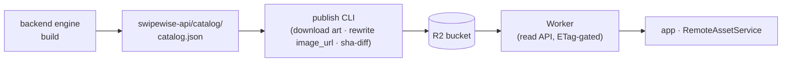
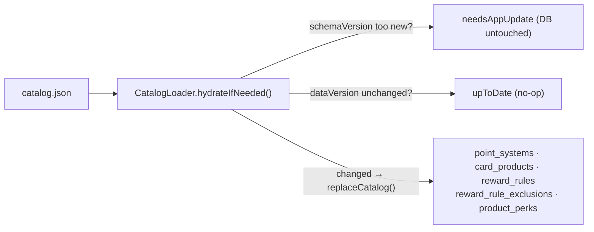
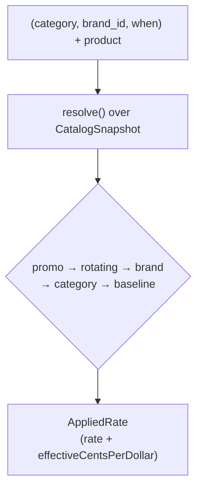

# Reward catalog & ranking

How per-card reward rates get into the app and how the "best card" ranker uses them. The
rewards system is a properly-modeled **catalog** + a pure **engine**: the old bundled
`reward_seed.json` + SQL ranker (`RewardSeedService` / `RewardRepository`) are deleted.

## Two repos: producer and consumer

The catalog is a **data product** built in a separate repo (the catalog pipeline,
the backend engine). It scrapes/curates issuer reward data and emits one
versioned JSON build. The app is purely the **consumer**: it fetches the latest build from
the catalog API and hydrates it locally. The "catalog in its own repo" split older docs
called a *future* state is now reality.

## Distribution

The build doesn't ship in the app binary — it's served by
[`swipewise-api`](../swipewise-api), the catalog service:



- **Publish** (`npm run publish:catalog`) downloads each card's art into R2, rewrites
  `image_url` to the R2 public URL, and uploads **only changed** objects (sha256 diff
  against an R2 manifest) — an unchanged catalog costs zero writes.
- **Serve** — the [Worker](../swipewise-api/src/worker.ts) reads `catalog.json` /
  `brands.json` from R2 and serves them ETag-gated, plus derived per-bank, per-card, and
  per-user (`/catalog/resolve`) slices for fetching less per screen.
- **Consume** — [`remote_asset_service.dart`](../lib/api/remote_asset_service.dart) fetches
  `$R2_BASE_URL/catalog.json` (the Worker URL) with `If-None-Match`, caches the body + ETag
  locally, and re-downloads only on a `200` (changed). `CatalogLoader` falls back to that
  local cache when the service is unreachable — the offline floor.

## `catalog.json`

`catalog.json` is the served build. Its header carries three versions:

| Field | Role |
|---|---|
| `catalogVersion` (`2026.06.18`) | human build label; stamped on each `card_products.catalog_version` |
| `dataVersion` (`2`) | content revision — the loader re-hydrates only when this **changes** |
| `schemaVersion` (`1`) | structural version — a build newer than the app understands is **rejected** (prompt "update SwipeWise") |

The body is already a normalized, table-shaped product — no app-side classification or
flattening. It carries five arrays, one per global catalog table:

```jsonc
{
  "catalogVersion": "2026.06.18", "dataVersion": 2, "schemaVersion": 1,
  "point_systems":  [ { "point_system_id": "usd", "display_name": "Cash back", "baseline_cent_value": 1.0 } ],
  "card_products":  [ { "card_product_id": "chase.prime-visa", "issuer": "Chase",
                        "display_name": "Prime Visa", "network": "visa",
                        "foreign_tx_fee_pct": 0.0, "image_url": "…", "catalog_version": "2026.06.18" } ],
  "reward_rules":   [ { "rule_id": "…", "card_product_id": "chase.prime-visa", "kind": "brand",
                        "brand": "whole-foods-market", "rate": 5, "point_system_id": "usd" },
                      { "rule_id": "…", "card_product_id": "chase.prime-visa", "kind": "baseline",
                        "rate": 1, "point_system_id": "usd" } ],
  "reward_rule_exclusions": [ { "rule_id": "…", "brand": "costco" } ],
  "product_perks":  [ … ]
}
```

Unlike the old seed, a `reward_rule` is **polymorphic by `kind`** (baseline / category /
brand / rotating / promo / partner_portal) and carries validity dates, spend caps,
exclusions, rotation windows, and a `point_system_id`. See
[database.md](database.md#rewards) for the exact columns.

> Card-art URLs point at issuer CDNs; they're functional image links (data) the producer
> supplies, not something the app generates. The build is **owned** by the catalog
> data-product domain (see [architecture.md](architecture.md)).

## Hydration

[`catalog_loader.dart`](../lib/api/catalog_loader.dart) — `CatalogLoader.hydrateIfNeeded(userId)`
runs on boot and after each sync, idempotently:



- It **version-gates** on `dataVersion`: re-hydrates only when the build's `dataVersion`
  differs from the last-loaded one (stored per-user via `SettingsRepository`), so it's cheap
  to call every boot.
- It **rejects a too-new `schemaVersion`** (returns `needsAppUpdate`, leaving the DB
  as-is).
- On a real load it **column-projects** each JSON object down to exactly the table's
  columns (a stray build key can never reach an `INSERT`), then
  [`CatalogRepository.replaceCatalog`](../lib/api/catalog_repository.dart) atomically
  replaces all five global tables in one transaction (deletes in reverse FK order, inserts
  in forward FK order).

The five hydrated tables — `point_systems`, `card_products`, `reward_rules`,
`reward_rule_exclusions`, `product_perks` — are **global** (no user FK): the same for
everyone, surviving user-scoped wipes.

## Linking a user's cards

The catalog is global; a user's *synced* cards have to be bound to a product before they
earn anything. [`card_link_service.dart`](../lib/api/card_link_service.dart) —
`CardLinkService.seedLinks(userId)` writes `card_links` rows after each sync. Resolution per
card, highest precedence first:

1. **explicit** — the card's `card_overrides.product_identification`, when it's a slug
   present in the *current* catalog (`source = preconfirmed`).
2. **heuristic** — fuzzy name match `cards.name` → `card_products.display_name` (Jaccard;
   bank-restricted pass at 0.30, then full catalog at 0.50), `confidence` stored.
3. **unmatched** — no row written; the Identify Card sheet is the user-facing affordance.

A `user_confirmed` link (written by the Identify Card flow via `confirmLink`) is the top of
the precedence ladder and is **never downgraded** by a re-seed. On a match the service also
canonicalizes the card's display name + art from the product (a `custom_name` override still
wins in the UI).

## The engine + ranker

[`reward_engine.dart`](../lib/api/reward_engine.dart) is a **pure** `resolve()` function —
no DB, no I/O, no Flutter. Its input is an immutable `CatalogSnapshot` (built once by
[`CatalogRepository.loadSnapshot()`](../lib/api/catalog_repository.dart) from the catalog
tables). It replaces `RewardRepository._runGeneralRanking` (~250 lines of SQL over the old
`wallet_rewards`).

Given `(product, category, brand?, when)` it returns an `AppliedRate`. **Resolution order**,
highest priority first:

1. **promo** — date-bounded; `rate == 0` intro-APR offers are skipped.
2. **rotating** — matching rotation year/quarter. **Assumed activated**: the app has no
   activation toggle, so an activation-required bonus still applies (gating on it would
   permanently hide the whole Freedom Flex / Discover it 5% program). The `rotating_activations`
   plumbing is retained for a future opt-in toggle but not consulted here.
3. **brand** — exact `brand_id`.
4. **category** — permanent.
5. **baseline** — the floor; always applies last.



Within a tier the richest rate is tried first, and the engine handles:

- **Travel superset** — a general `travel` rule also earns at its sub-categories (hotels /
  airlines / car rentals / transit), so a "3× travel" card competes at a hotel; the
  richest-rate sort then picks the better of the specific and general bonus. A rule can carve
  a sub-category out via `excluded_categories` when the issuer's terms exclude it — Citi's
  Costco "travel" 3% earns only the 1% base on train/commuter transit — so the general rate
  doesn't leak onto it. (Curated in the backend engine's `overrides.yaml`; see the catalog repo.)
  The same superset holds for `gas` ⊃ `evCharging` — a general `gas` rule competes at an
  `evCharging` lookup unless a rule carves it out via `excluded_categories`.
- **Exclusion cascade** — a rule whose `reward_rule_exclusions` carve out the queried brand
  is skipped, falling through to the next priority ("wholesale 2% *except Costco*").
- **Spend caps** — a `cap_spend_amount_usd` rule blends the bonus rate up to the cap and the
  baseline rate beyond it (the cap-aware blended rate); an exhausted cap cascades.
- **Point valuations & FX** — `effectiveCentsPerDollar` = `rate × point-system cent value`,
  minus the card's `foreign_tx_fee_pct` when the purchase is foreign. This single
  cross-currency-comparable number is the **only** key ranking compares, so a 5% cashback
  rule and a 5×-points rule sort correctly against each other.

[`engine_ranker.dart`](../lib/api/engine_ranker.dart) (`EngineRanker`) is the ranking layer
— it loops `resolve()` over the user's linked cards to produce the same outputs the UI
already consumed (best card per category, best card per brand, the catch-all card, and the
reward-ranking sheet). It's the engine-side analogue of `RewardRepository`'s three ranking
queries; cards are ranked on `effectiveCentsPerDollar` while each row's displayed `rate`
stays the raw multiplier. Ties break preference order → name desc (as the SQL did). **Brand
beats category** when both apply (it sits higher in the resolution order). The catch-all
card is the highest `baseline` rate.

`bestCardByBrand()` powers the Advisor's **Brands** tab: it resolves *every* registered
merchant (the full `registeredBrands()` list, not just brands named in a rule) to the user's
best card, so a brand with no specific bonus still shows the card it falls back to. Rows
whose resolved rate beats baseline ("wins") sort above the flat-rate tail — which all
resolves to the same catch-all card. A brand is dropped only when no linked card has any
applicable rule (the no-`baseline` store-card case).

The reward-ranking sheet renders two sections — general ranking + brand bonuses within the
category — and flips their order by entry point (merchant tap or Brands-tab tap → brand-first;
category tap → general-first).

## Perks

[`product_perks`](../lib/api/database_helper.dart) **replaces** the old `card_perks`. It's
**global catalog data** attached to a `card_product_id` (not user-scoped) and surfaced for a
user's card via a `card_links` join (`CatalogRepository.perksForCard`). It's display-only:
the table holds no user redemption state, so every perk is shown as available.

## The slug contract (still the contract)

The catalog only **references** the app's vocabularies; it never re-derives them:

- `reward_rules.category` references `RewardCategory` names — the app owns the enum
  ([reward_category.dart](../lib/models/reward_category.dart)).
- `reward_rules.brand` / `reward_rule_exclusions.brand` reference `brand_id` slugs from
  `brands.json` (served by the [catalog API](../swipewise-api); see
  [classifier-and-brands.md](classifier-and-brands.md)).

A rule that references a slug the classifier can't produce is **dead** — no transaction will
ever carry it. That's why brand/category coverage is a build-time contract (see
[the slug contract](../todo/rewards_catalog.md#the-slug-contract-brands--categories)). The
classifier's `(category, brand_id)` output and these slug vocabularies are unchanged from the
seed era; only the rate data behind them got richer.

## "Earned in this category" badge

The reward sheet historically showed how much you'd earned in a category recently — a
subquery that joined `transactions` on **`reward_category`** (the canonical enum name), not
the display `category`, so it matched the same vocabulary `reward_rules.category` uses. In
the catalog engine, currency is typed (`point_systems.baseline_cent_value`) rather than
inferred, so the old cashback-vs-points heuristic guard is gone; the engine's
`effectiveCentsPerDollar` axis is currency-aware directly.
