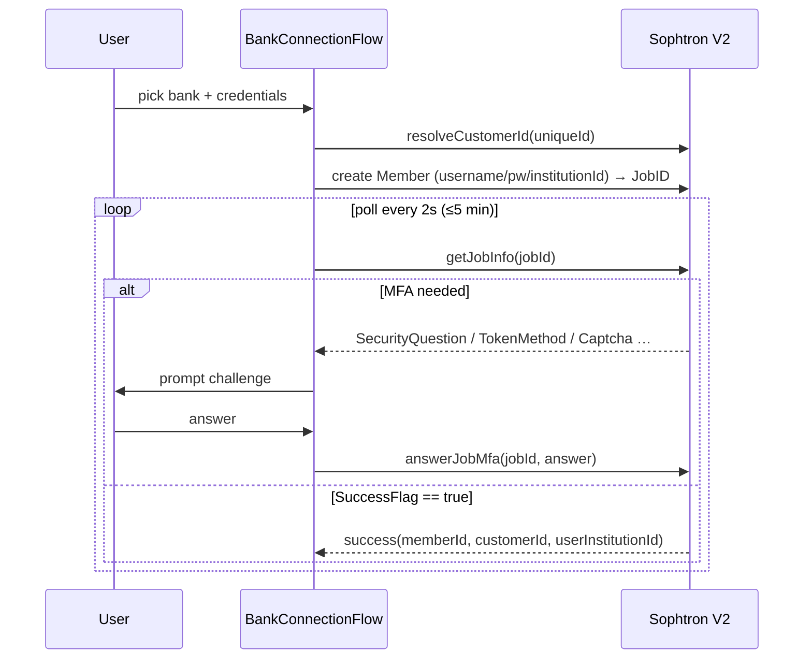
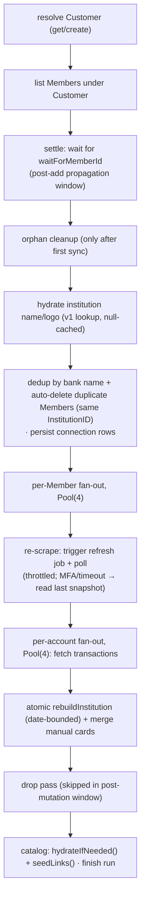

# Sophtron bank sync

How SwipeWise links banks and pulls transactions. One aggregator (Sophtron), two API
surfaces: **V2** for the connect lifecycle (no FDX connect surface exists) and **V3
(FDX-standard)** for all account/transaction reads, isolated behind one mapper so the
aggregator is swappable.

## Auth — the app signs nothing

Requests go to the **account service**, not to the aggregator. The app sends who it is; the
service checks entitlement, refuses anything off its allowlist, substitutes the Customer id
and signs with credentials the app has never seen.

- **`BankClient._request`** calls `${ACCOUNT_API_URL}/aggregator/<path>` with two headers: a
  Firebase ID token (*which user*) and an App Check token (*a genuine install*). No HMAC, no
  `Authorization: FIApiAUTH:…`, no aggregator credentials — none of that exists in the app.
- **`resolveCustomerId()` returns the literal `~me`.** The app cannot name a Customer: it
  writes a placeholder and the server substitutes the id it looked up from the token. There is
  no customer field in any request, which makes tampering structurally impossible rather than
  a check somebody has to remember.
- **There is no customer salt.** The id used to be `sha256(email | salt)` because there was no
  server to remember one — which made the salt unrotatable forever, since changing it orphans
  every bank link. The service stores the mapping in `sophtron_customers` instead.

The HMAC scheme itself, the path allowlist and the job-ownership check now live in the
account service (`swipewise-backend/swipewise-account/src/aggregator.ts`), along with the
tests that pin them.

## Connect flow (V2) — the MFA state machine

[`bank_connection_flow.dart`](../lib/sync/bank_connection_flow.dart) drives linking as a
sealed `SophtronV2ConnectionState` machine (`idle → resolvingCustomer →
submittingCredentials → polling → challenge? → success|failed`).

- The password is forwarded to Sophtron and immediately discarded (never stored/logged).
- MFA dispatch order mirrors the upstream adapter: security questions → token method →
  token input → token read → captcha.
- Hard timeout: 5 minutes; poll interval 2s.
- The link job defaults to **`aggregate_extendedhistory`** (deep backfill), so a new
  connection pulls the issuer's full available history (~12–24 months) up front rather than
  the shallow default-depth window.

## Read flow (FDX V3)

[`bank_client.dart`](../lib/api/bank_client.dart):

- **Accounts:** `GET v3/Customers/{cid}/Members/{mid}/accounts` — balances inline, each
  wrapped in a `depositAccount` node.
- **Transactions:** `GET v3/Customers/{cid}/accounts/{aid}/transactions?startDate&endDate`
  — default window 10 years.

**FDX V3 returns less than its schema suggests.** What you get vs. what's missing:

| Returned | Missing (not in the FDX read schema) |
|---|---|
| amount, type (DEBIT/CREDIT), status, dates, description, memo, bank `category` | **MCC** code |
| account balances, masked number, type, currency, `fiAttributes` (incl. `DueDate`) | **separate merchant field** (falls back to `description`) |
| | **lat/lng**, card **network**, reward balances |

Practical consequences: `category` is the bank's free-text label only (present on some
issuers, e.g. Chase; absent on others); the classifier runs on `description`; **there is no
pending status** — Sophtron returns `POSTED` for every row, even just-occurred ones, so a
recent purchase appears (as `POSTED`) only once the member is re-scraped (see
[the sync engine](#the-sync-engine)); credit limit is derived only when both balance +
available are present, else manual.

⚠️ **These are hard limits, not gaps to close** — nothing in this list arrives with a different
query, so the features that need them cannot be built from bank data: MCC-first categorization, a
geo-tagged transaction map, a points/miles ledger derived from bank data, pending badges, and
FX-bonus detection. (Each *account* does carry its own `currency`, so a USD/CAD multi-currency
wallet is fine; only cross-currency *FX detection* is out.)

A v3 *read* returns whatever the member's **last job** scraped — passing an earlier
`startDate` never fetches older data. Getting fresh or deeper data requires running a
**job**, which the sync engine now triggers on every sync (see below).

## The mapper

[`bank_fdx_mapper.dart`](../lib/api/bank_fdx_mapper.dart) is the **one** FDX-aware seam —
`BankFdxMapper.account()` / `.transaction()` turn FDX JSON into neutral
`BankAccount`/`BankTransaction` records. It unwraps the `depositAccount`/`depositTransaction`
node, reads `fiAttributes` (a `[{Name,Value}]` list) for things like `institution_id` and
`DueDate`, is null-safe on every field, and keeps the full source JSON in `.raw`. Nothing
downstream knows which aggregator produced the data — swap aggregators by rewriting this
file.

## Stable IDs

Deterministic ids let user overrides survive re-syncs and disconnects.
[`bank_write_repository.dart`](../lib/api/bank_write_repository.dart):

- **Card:** `bank:<institutionId>:<lastFour>:<accountSlug>` (`stableCardId()`). The slug
  (lowercase-alphanumeric of nickname/accountId, ≤16 chars) disambiguates two cards at the
  same bank sharing a last-four.
- **Transaction:** `<stableCardId>:<date>:<cents>:<sha1(normalized description)[0:10]>`
  (`transactionStableId()`) — re-syncs collapse duplicates instead of doubling rows.

Because ids are stable, `card_overrides` (credit limit, custom name, product
identification) re-attach automatically when a card with the same id reappears.

## Per-institution atomic rebuild

`rebuildInstitution()` runs one SQLite transaction per bank: **wipe** that institution's
prior `cards`/`financial_accounts` rows (prefix `bank:<institutionId>:`) and re-insert them,
then **insert** the fetched transactions. `card_overrides` is **never** wiped — that's how
overrides survive. A failure rolls back only that bank; other banks keep their data. After
the rebuild, `mergeManualCardsWithBank()` folds any manually-added card with a matching
`(provider, last_four)` into the synced row.

**Transactions are date-bounded, not blanket-wiped.** For each account, only rows at or
newer than the oldest row this scrape returned are deleted before re-insert; everything
older is **frozen as a local archive**. This keeps full history from link onward even when
the issuer later serves a shorter window or a light refresh runs (the archive can't be
truncated), and it's safe because `transactions.card_id` has no FK — replacing a card never
cascade-deletes its transactions. An account that returns nothing is left untouched.

## The sync engine

[`bank_sync_engine.dart`](../lib/sync/bank_sync_engine.dart) — `run()` orchestrates a whole
sync:

Key behaviors:
- **Bounded fan-out** — `Pool(4)` per member and per account; Sophtron forwards to issuers
  that rate-limit hard.
- **Post-mutation window** — when a sync fires right after `createMember`, the Members index
  can return only the just-touched member for a few seconds. A settle loop (2s × ≤30s) waits
  for the expected id, and the drop pass is **skipped**, so a partial snapshot can't wipe
  good local rows.
- **Orphan cleanup** is gated on `firstSyncCompleted` — on a fresh install the local DB is
  empty by design, so without the gate every Member would look orphaned.
- **Name dedup** collapses an issuer that appears under multiple institution ids ("Chase",
  "Chase Bank") to the most-recently-modified Member (this picks which Member to *read*).
- **Refresh-on-sync (re-scrape)** — before reading a member, the engine triggers a standard
  `aggregate` refresh **job** and polls briefly for completion (`_refreshMemberIfDue`), so
  the v3 reads return current data instead of replaying the last job's snapshot. Best-effort:
  on an MFA challenge, timeout, or error it logs and reads the last snapshot (never blocks).
  **Throttled** — a member refreshed (*attempted*) within 15 min is skipped (per-member
  timestamp in `settings`), so repeated pulls stay fast and issuers aren't hammered; the
  throttle counts *attempts*, not just successes, so a slow or MFA-gated member isn't
  re-tried every sync. This is the fix for stale/missing recent activity and short history.
- **Member auto-dedup** — re-linking the same bank leaves multiple Members with the **same
  `InstitutionID`** (and identical accounts). The engine keeps the most-recently-modified per
  `InstitutionID` and `deleteMember`s the rest at Sophtron, so duplicates don't multiply
  scrape/refresh work. Gated like orphan cleanup (post-first-sync, outside the post-mutation
  window); never deletes a name-dedup winner.
- Per-member status (`ok`/`failed`) lands on `bank_connections`; transient errors (5xx/408/
  429/timeout) preserve the prior status (retried implicitly next sync) rather than showing
  a red ✗.
- Progress is a `Stream<SyncProgressEvent>` ([sync_progress_event.dart](../lib/sync/sync_progress_event.dart))
  the first-sync screen renders as real per-bank progress.

## Sync state & coordination

[`sync_state_repository.dart`](../lib/api/sync_state_repository.dart):

- **Mutex** (`sync_state` table) — every sync path `acquireSyncLock` before running the
  engine. The holder bumps `heartbeat_at` on every
  progress event, so liveness is judged by the heartbeat, not total runtime: a run whose
  heartbeat has lapsed (default 60s, `syncLockLiveness`) is treated as crashed and is
  stealable, while a healthy long sync is never stolen. A 15-min hard cap (`syncLockTtl`)
  backstops a wedged-but-still-beating run. `acquireSyncLock` returns a fencing token (the
  acquire timestamp); `heartbeatSyncLock`/`releaseSyncLock` only touch the row while it
  still carries that token, so a run whose lock was stolen out from under it can't resurrect
  or clear the new holder's lock. When a pull-to-refresh finds the lock held by a *live*
  run, it doesn't fake success — it follows that run to completion (the refresh spinner
  stays up), then refreshes the data providers; if the run goes stale mid-wait it steals the
  lock and runs itself. See `BankSyncNotifier._followRunningSync`.
- **Telemetry** (`sync_runs`) — per-run timing + member/card/tx/error counts + outcome,
  pruned to the last 100. Answers "why did sync take 90s?".
- **Circuit breakers** (`api_circuit_breakers`) — cross-isolate breaker state for external
  APIs (e.g. Google Places): N failures → fast-fail for a cooldown window.

There is no background sync. Syncing is user-initiated — pull-to-refresh, or the sync
that follows a link. A `workmanager` 8-hourly tick used to exist behind an `auto_sync`
setting; it was removed on 2026-08-12, having never been reachable (no UI ever set the
setting, and nothing watched its provider). The mutex above still earns its keep: the
link's first sync and a pull-to-refresh can still overlap.

`LinkSyncForegroundService` is not background sync — it holds the foreground notification
so a link *you started* survives you switching apps, including while it waits on an OTP.
