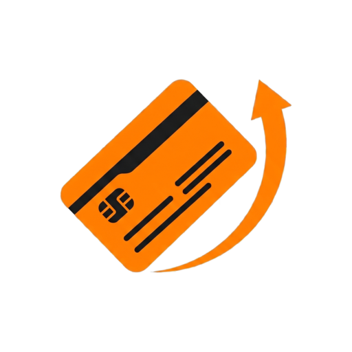

# SwipeWise — Play Store listing

The assets that ship on the store listing, and the declarations SwipeWise makes about the data it
handles. The declarations live here, in the public repo, for the same reason
[`docs/BACKUP_SCHEMA.md`](../docs/BACKUP_SCHEMA.md) does — so they can be checked against the code
that produces them.

The store listing, this file and the
[privacy policy](https://jacobcelestine.com/swipewise/privacy_policy.html) have to agree. Change
one, change all three.

## Assets

| Console field | Source | Spec |
|---|---|---|
| App name | — | `SwipeWise` |
| App icon | `icon_512.png` | 512×512, opaque |
| Feature graphic | `cover.png` | 1024×500 |
| Phone screenshots | `screenshots/free/*.png` — all 5 | ≤2:1, 320–3840 px/side |
| Short description | *Which credit card to use at every store — for maximum cashback and points.* | ≤80 |
| Full description | `full_description.txt` | ≤4000 |
| Category / tag | — | Finance / Personal finance |
| Target audience | — | **18+ only** — any younger band triggers Families policy |

⚠️ **Screenshots must match the build being listed.** `shellTabs(isPro)` in
`lib/widgets/app_tab_bar.dart` gives a free user three tabs — Cards, Advisor, Profile — while every
original frame in `../wireframe.pen` draws four. `screenshots/free/` was exported from the
`FREE — *` frames, which disable the extra tab; the bar is `space_around`, so the remaining three
re-space cleanly. **Re-export from the original frames and you ship a tab that does not exist.**

Two frames are deliberately excluded: `Merchant Detail` is spend/visits/history, and `Card Details
Sheet` shows a transaction-derived "Used" figure. Neither is available in the listed build.

`screenshots/pro/` holds the four-tab set, kept for when those tabs ship. **Never upload it to the
current listing** — two of them show screens the listed build does not have, which is a misleading
listing regardless of the code being present.

## Data safety

What leaves the device, and under what conditions.

| Category → Type | Collected | Shared | Required? | Purpose | Linked |
|---|---|---|---|---|---|
| Location → Precise location | Yes | **Yes** | Optional | App functionality | No |
| Personal info → Name | Yes | No | Optional | App functionality | **Yes** |
| Personal info → Email address | Yes | No | Optional | App functionality | **Yes** |
| Personal info → User IDs | Yes | No | Optional | App functionality | **Yes** |
| Financial info → User payment info | Yes | No | Optional | App functionality | **Yes** |
| Financial info → Other financial info | Yes | No | Optional | App functionality | **Yes** |
| App info and performance → Crash logs | Yes | No | **Required** | **Analytics** | No |
| App info and performance → Diagnostics | Yes | No | **Required** | **Analytics** | No |
| Device or other IDs | Yes | No | **Required** | **Analytics** | No |

Everything else **No**. Nothing is **Ephemeral**.

"Collected" means *transmitted off the device* — to us or to anyone else. It does not mean stored:
everything in `swipewise.db` stays on the phone unless the user signs in and switches backup on.

- **Precise, not Approximate** — the coordinate is rounded to ~110 m, but Google's "approximate"
  means an area of ≥3 km². 110 m is ~0.04 km², and the app requests `ACCESS_FINE_LOCATION`.
- **Only location is Shared.** Sharing means transfer to a third party; Google Places is one.
  Firebase and Cloudflare process on our behalf, which is collection, not sharing.
- **Nothing is Ephemeral.** Our own service holds location in memory and stores nothing, but that
  option asserts it about the whole path, and Places' retention is not ours to promise.
- **Crash data is Analytics**, not App functionality — Google's definition is "diagnose and fix bugs
  or crashes". Location stays App functionality; there the data *is* the feature.
- **Crash data is Required, everything else Optional.** Crashlytics has no in-app toggle. Location
  has a permission the user can decline. The Personal info rows need sign-in; the Financial info
  rows need sign-in **and** backup switched on.
- **Financial info is declared** because a backup carries last-four digits and the manual credit
  limit ([`docs/BACKUP_SCHEMA.md`](../docs/BACKUP_SCHEMA.md)), both reachable without a bank via
  `manual_card_flow_screen.dart`.
- **Health and fitness is not declared.** The app holds `ACTIVITY_RECOGNITION`, but the reading
  never leaves the device, so nothing is collected. That answer and the permission declaration
  below are consistent: one describes a permission, the other describes transmission.

### Security

| Question | Answer |
|---|---|
| Allows account creation? | **Yes — OAuth.** Signing in with Google mints a Firebase Auth user |
| Log in with accounts made outside the app? | Yes |
| Encrypted in transit / at rest | Yes / Yes |
| Data deletion request? | **Yes** — https://jacobcelestine.com/swipewise/delete_account.html |
| Deletion *without* deleting the account? | No — turning backup off keeps the stored copy |

Account creation gates the deletion question: answering "no" makes that answer unreachable.
On-device, `swipewise.db` relies on Android's full-disk encryption, not an app-level layer — say so
rather than implying a second one. **Sign-out never deletes anything**, locally or server-side.

## Permission declarations

**Advertising ID — not used.** No `AD_ID` permission, no ads SDK, nothing pulls one transitively.

### ACTIVITY_RECOGNITION

Appears under *Health data permissions*, because Android treats physical activity as
health-adjacent. Answering "no health features" elsewhere stays correct; this is where the
non-health use gets explained.

> SwipeWise notifies users when they arrive at a nearby store where one of their credit cards
> earns extra rewards. It uses activity recognition for one purpose: to tell an actual store
> visit apart from driving past one.
>
> The app subscribes to activity transitions for IN_VEHICLE, STILL and WALKING. When a
> transition fires, the app records only the most recent activity type and its timestamp. If
> the latest reading is IN_VEHICLE and less than 30 minutes old, arrival notifications are
> suppressed — this stops users being alerted at a red light beside a shop they are not
> visiting. The same signal is used to defer re-registering geofences until the user has
> stopped driving, which avoids doing location work mid-journey.
>
> SwipeWise does not provide health or fitness features. No activity history is collected,
> stored beyond the single most recent reading, aggregated, or transmitted off the device — the
> value is written to local app storage and read back by the notification logic. The permission
> is optional; declining it only makes arrival notifications less accurate.

Accurate against `ActivityState.kt` and `ActivityTransitionReceiver.kt` — the 30-minute
`isLikelyDriving` window and SharedPreferences-only storage. **If that logic changes, change this.**

### FOREGROUND_SERVICE_DATA_SYNC

Declared as **Data sync → Network processing**, and as *user-initiated*: the service runs only
during a bank connection the user started, holding the network open while the app polls for
one-time-passcode prompts. It posts a visible progress notification for its entire lifetime and
stops when the connection ends. There is no background data sync in the app — accounts refresh only
when the user opens it and pulls to refresh.

### ACCESS_BACKGROUND_LOCATION

> Arrival alerts. SwipeWise registers geofences around nearby stores where one of the user's
> cards earns extra rewards. When the user arrives and stays, Android wakes the app and it posts
> a notification naming the best card — for example "You're at Whole Foods, use your Prime Visa
> for 5%". That reminder is only useful at the moment of payment, with the phone in a pocket, so
> it has to work when the app is closed or not in use.

**Why foreground-only is insufficient:**

> The alert exists to reach the user as they walk into a shop, when the phone is in their
> pocket. Foreground-only access would require the user to open the app and keep it on screen
> at the moment of arrival — by which point they already know where they are, and the
> recommendation has no value. There is no version of this feature that works while the app is
> in the foreground.

**How location is handled:**

> Detection runs on the device. SwipeWise registers native Android geofences for nearby stores
> and the operating system performs the dwell detection; the app is woken only when an arrival
> fires. To find which stores are nearby, a latitude/longitude rounded to three decimal places
> (~110 m) is sent to a stateless SwipeWise lookup service, which forwards it to the Google
> Places API and returns the results; that service exists so the Google API key is held on a
> server rather than inside the app, and it stores and logs nothing it receives. No location
> history is retained anywhere: the only position stored at rest is a single row on the device
> recording where geofences were last registered, overwritten on every refresh and deleted on
> uninstall.

These use Google's own phrase — *"when the app is closed or not in use"* — and match the in-app
disclosure in `NearbyPermissionGate`, which is what reviewers cross-check.

## Regenerating assets

- **Icon** — `magick assets/icon_foreground.png -resize 512x512 -background white -alpha remove -flatten play_store_listing/icon_512.png`
- **Feature graphic** — Gemini, with [`../assets/logo.png`](../assets/logo.png) as the brand
  reference; 1024×500, dark background, no baked-in text.
- **Screenshots** — export the `FREE — *` frames from `../wireframe.pen` (Pencil MCP), then pad to
  ≤2:1 using each screen's own background.
